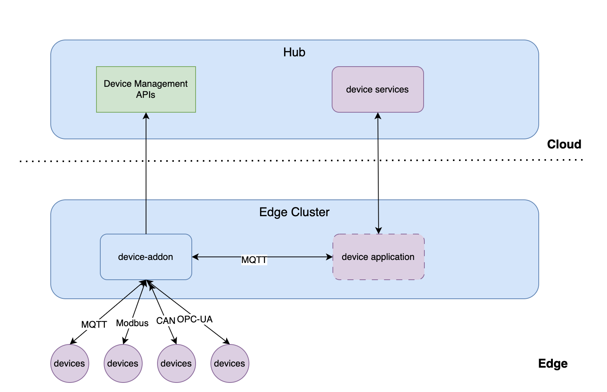

# device-addon

The device-addon integrates devices connected to IoT application layer.

## Features

- Unified Kubernetes style device management APIs.
    - `Driver` defines a type of devices using same kind of protocol, which includes protocol properties, like the MQTT, OPC UA, etc.
    - `Device` gives the definition of a specific device, like what data attributes does the device have, what commands can the device support.
- Centralized management of the device on a central hub, user manage their device on the hub with device management APIs, on the edge cluster, the device-addon gets the device meta information from the hub with device management APIs and manages the device with the device meta information.
- Easily publish device data to IoT application layer via MQTT protocol, by default, device-addon start a build-in MQTT broker, IoT application/services can subscribe the device data from the broker, user also can use `DeviceAddOnConfig` API to configure an external broker for the device-addon.
- Multiple protocol support
    - The device-addon is able to collect data from IoT devices that are connected to external MQTT brokers.
    - The device-addon is able to collect data from IoT devices that are connected to OPC-UA servers.
    - TBD Modbus, CAN, BACnet etc.

## Architecture

1. User defines their devices with device management APIs on the hub cluster.
2. The device-addon watched the device management APIs.
3. The device-addon connects the devices according to the device protocol configuration that is defined with the device management APIs.
4. The device-addon collects the devices data according to the device data mate information that is defined with the device management APIs.
5. The device-addon publishes the collected devices data to the edge applications/services via MQTT protocol.
6. The edge applications/services handle the collected devices

## TODO list

- [ ] Support read commands to read the data from devices actively.
- [ ] Support write commands to write the data to devices.
- [ ] Support to persist the device data on the edge cluster.
- [ ] Support to query the history data on the edge cluster.
- [ ] Support more IoT protocols, such as Modbus, CAN, BACnet etc.
- [ ] The authentication and authority.
