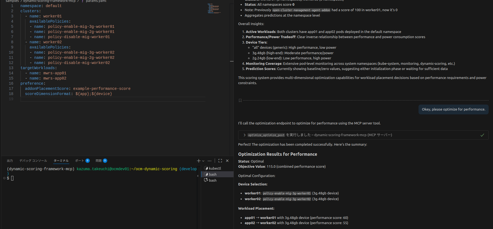

# Development Guide

This guide provides step-by-step instructions for setting up a development environment for the Dynamic Scoring Framework. The framework enables dynamic scoring and optimization of workload placement in Open Cluster Management (OCM) environments.

## Prerequisites

Before starting, ensure you have the following tools installed on your development machine:

- **`podman` or `docker`**: Container runtime for building and running container images
- **`kind`**: Kubernetes IN Docker - for creating local Kubernetes clusters
- **`kubectl`**: Kubernetes command-line tool for cluster management
- **`helm`**: Kubernetes package manager for installing charts
- **`golang:1.24`**: Go programming language for building the controller and addon
- **`jq`**: JSON processor for parsing API responses (optional but recommended)

## Create Development Environment

### Step 1: Install clusteradm CLI

The `clusteradm` CLI tool is required for managing OCM clusters. Install it on your host OS:

```bash
curl -L https://raw.githubusercontent.com/open-cluster-management-io/clusteradm/main/install.sh | bash
```

Verify the installation by checking the version:

```bash
$ clusteradm version
client          version :v1.1.1-0-g802869e
server release  version :v1.32.2
default bundle  version :1.1.1
```

### Step 2: Create Kubernetes Clusters

Create three Kubernetes clusters using `kind`:
- **hub01**: The hub cluster that manages worker clusters
- **worker01**: First managed cluster for workload execution
- **worker02**: Second managed cluster for workload execution

```bash
kind create cluster --name hub01
kind create cluster --name worker01
kind create cluster --name worker02
```

### Step 3: Initialize OCM Hub Cluster

Initialize the hub cluster with OCM components. This installs the necessary controllers and CRDs for cluster management:

```bash
clusteradm init --wait --context kind-hub01 --bundle-version=latest
```

This command:
- Installs OCM hub components (cluster-manager)
- Sets up necessary CRDs for managing clusters
- Prepares the hub for accepting managed clusters

### Step 4: Join Worker Clusters to Hub

First, obtain the join token from the hub cluster. This token is used to authenticate worker clusters:

```bash
$ clusteradm get token --context kind-hub01
token=TOKEN
please log on spoke and run:
clusteradm join --hub-token TOKEN --hub-apiserver https://127.0.0.1:36197 --cluster-name <cluster_name>
```

**Note**: Save the `TOKEN` value and API server URL - you'll need them in the next steps.

Now, join each worker cluster using the token. The `--force-internal-endpoint-lookup` flag ensures proper networking in kind clusters:

```bash
clusteradm join --hub-token TOKEN --hub-apiserver https://127.0.0.1:36197 --cluster-name worker01 --context kind-worker01 --force-internal-endpoint-lookup --wait
```

```bash
clusteradm join --hub-token TOKEN --hub-apiserver https://127.0.0.1:36197 --cluster-name worker02 --context kind-worker02 --force-internal-endpoint-lookup --wait
```

**Replace `TOKEN` and the API server URL** with the values from the previous command.

### Step 5: Accept Join Requests

The hub cluster needs to approve the join requests from worker clusters:

```bash
clusteradm accept --context kind-hub01 --clusters worker01,worker02 --wait
```

This creates the necessary resources (ManagedCluster, klusterlet) for each worker cluster.

### Step 6: Verify Cluster Registration

Confirm that the worker clusters are successfully joined and available:

```bash
$ kubectl get managedclusters --all-namespaces --context kind-hub01
NAME       HUB ACCEPTED   MANAGED CLUSTER URLS                  JOINED   AVAILABLE   AGE
worker01   true           https://worker01-control-plane:6443   True     True        150m
worker02   true           https://worker02-control-plane:6443   True     True        148m
```

Both clusters should show:
- **HUB ACCEPTED**: true
- **JOINED**: True
- **AVAILABLE**: True

### Step 7: Create Namespaces

Create the `dynamic-scoring` namespace on all clusters. This namespace will host the Dynamic Scoring Framework components:

```bash
kubectl create namespace dynamic-scoring --context kind-hub01
kubectl create namespace dynamic-scoring --context kind-worker01
kubectl create namespace dynamic-scoring --context kind-worker02
```

Set the default namespace for each context to simplify subsequent commands:

```bash
kubectl config set-context kind-hub01 --namespace=dynamic-scoring
kubectl config set-context kind-worker01 --namespace=dynamic-scoring
kubectl config set-context kind-worker02 --namespace=dynamic-scoring
```

---

## Install Dynamic Scoring Framework Addon

The Dynamic Scoring Framework consists of two main components:
1. **Controller**: Runs on the hub cluster, manages DynamicScorer and DynamicScoringConfig CRs
2. **Addon Agent**: Runs on worker clusters, performs actual scoring operations

### Dynamic Scoring Framework Controller

The controller manages the lifecycle of DynamicScorer resources and synchronizes configurations to worker clusters.

Build the controller image:

```bash
make docker-build IMG_CONTROLLER=quay.io/open-cluster-management/dynamic-scoring-controller:latest
```

Load the image into the hub cluster and deploy:

```bash
export IMG_CONTROLLER=quay.io/open-cluster-management/dynamic-scoring-controller:latest
kind load docker-image $IMG_CONTROLLER --name hub01
make deploy IMG_CONTROLLER=$IMG_CONTROLLER
```

Verify the controller is running on the hub cluster:

```bash
$ kubectl get pods
NAME                                                      READY   STATUS    RESTARTS   AGE
ocm-dynamic-scoring-controller-manager-69f576d9fc-sz55g   1/1     Running   0          33s
```

The controller is now ready to manage DynamicScorer CRs.

### Dynamic Scoring Framework Addon

The addon agent runs on each worker cluster and performs the following tasks:
- Fetches data from monitoring systems (e.g., Prometheus)
- Sends data to scoring endpoints
- Updates AddOnPlacementScore resources with the results
- Exports metrics to Prometheus

Build the addon image:

```bash
make docker-build-addon IMG_ADDON=quay.io/open-cluster-management/dynamic-scoring-addon:latest
```

Load the addon image into all clusters (hub and workers):

```bash
export IMG_ADDON=quay.io/open-cluster-management/dynamic-scoring-addon:latest
kind load docker-image  $IMG_ADDON --name hub01
kind load docker-image  $IMG_ADDON --name worker01
kind load docker-image  $IMG_ADDON --name worker02
```

Deploy the addon using OCM's addon framework:

```bash
make deploy-addon IMG_ADDON=$IMG_ADDON
```

Verify that addon agents are running on each worker cluster:

```bash
$ kubectl get pods --context kind-worker01
NAME                                     READY   STATUS    RESTARTS   AGE
dynamic-scoring-agent-6f7bcdd467-vn68j   1/1     Running   0          64s
$ kubectl get pods --context kind-worker02
NAME                                     READY   STATUS    RESTARTS   AGE
dynamic-scoring-agent-77bd85bb96-r9dk5   1/1     Running   0          69s
```

Each agent pod is now ready to receive scoring configurations and perform scoring operations.

---

## Install Skupper for Cross-Cluster Communication (Optional)

Skupper enables secure Layer 7 networking across clusters without requiring VPNs or firewall changes. This is useful when:
- Scoring services need to be accessed from multiple clusters
- You want to centralize metric collection
- Worker clusters cannot directly reach external scoring endpoints

### Install Skupper Site Controller

Install the Skupper site controller on each cluster:

```bash
kubectl create namespace skupper-site-controller --context kind-hub01
kubectl apply -f deploy/skupper/deploy-watch-all-ns.yaml --context kind-hub01
kubectl create namespace skupper-site-controller --context kind-worker01
kubectl apply -f deploy/skupper/deploy-watch-all-ns.yaml --context kind-worker01
kubectl create namespace skupper-site-controller --context kind-worker02
kubectl apply -f deploy/skupper/deploy-watch-all-ns.yaml --context kind-worker02
```

### Configure Podman Network for Kind Clusters

For kind clusters to communicate via Skupper, create a shared podman network:

```bash
podman network create my-kind-net
podman network connect my-kind-net hub01-control-plane
podman network connect my-kind-net worker01-control-plane
podman network connect my-kind-net worker02-control-plane
```

Verify the network configuration:

```bash
podman network inspect my-kind-net  # Check connected clusters
```

### Setup Skupper Sites

Get the hub cluster's IP address on the shared network:
kubectl create namespace skupper-site-controller --context kind-worker02
kubectl apply -f deploy/skupper/deploy-watch-all-ns.yaml --context kind-worker02
```

### Configure Podman Network for Kind Clusters

For kind clusters to communicate via Skupper, create a shared podman network:
podman network create my-kind-net
podman network connect my-kind-net hub01-control-plane
podman network connect my-kind-net worker01-control-plane
podman network connect my-kind-net worker02-control-plane
podman network inspect my-kind-net # Check connected clusters
```

Get the hub cluster IP address.

```bash
HUB_NODE_IP=$(podman inspect hub01-control-plane | jq -r '.[0].NetworkSettings.Networks["my-kind-net"].IPAddress')
echo $HUB_NODE_IP
```

Run the skupper setup script to configure sites and establish connections:

```bash
HUB_NODE_IP=$HUB_NODE_IP ./reset_skupper.sh
```

By default, the script uses the `dynamic-scoring` namespace. To use a different namespace, set the `NAMESPACE` environment variable.

Verify the Skupper connection status on the hub:

```bash
$ skupper status
Skupper is enabled for namespace "dynamic-scoring" with site name "hub". It is connected to 2 other sites. It has no exposed services.
```

The message indicates successful connection to both worker clusters.

---

## Install Prometheus for Metrics Collection

Prometheus is required for collecting metrics from worker clusters. The Dynamic Scoring Framework uses these metrics as input for scoring algorithms.

Add the Prometheus Helm repository:

```bash
helm repo add prometheus-community https://prometheus-community.github.io/helm-charts
helm repo update
```

Install the kube-prometheus-stack on each cluster. This includes:
- Prometheus server for metrics collection
- Grafana for visualization
- Alertmanager for alerting
- Node exporter and kube-state-metrics

```bash
helm install kube-prometheus prometheus-community/kube-prometheus-stack --namespace monitoring --create-namespace --kube-context kind-hub01
helm install kube-prometheus prometheus-community/kube-prometheus-stack --namespace monitoring --create-namespace --kube-context kind-worker01
helm install kube-prometheus prometheus-community/kube-prometheus-stack --namespace monitoring --create-namespace --kube-context kind-worker02
```

**Note**: Installation may take a few minutes. Wait for all pods to be ready before proceeding.

---

## Install VictoriaMetrics for Centralized Metrics Storage (Optional)

VictoriaMetrics provides a centralized, high-performance time-series database. When combined with Skupper, it enables:
- Centralized metric storage from all clusters
- Efficient querying across multiple clusters
- Long-term metric retention

### Install VictoriaMetrics

Add the VictoriaMetrics Helm repository:

```bash
helm repo add vm https://victoriametrics.github.io/helm-charts/
helm repo update
```

Set up Skupper in the monitoring namespace and install VictoriaMetrics:

```bash
HUB_NODE_IP=$HUB_NODE_IP NAMESPACE=monitoring ./reset_skupper.sh
helm install victoria-metrics vm/victoria-metrics-single -n monitoring
```

Expose VictoriaMetrics service via Skupper so worker clusters can send metrics:

```bash
skupper expose service victoria-metrics-victoria-metrics-single-server --address=vm-hub --port=8428 --namespace monitoring
skupper status --namespace monitoring
```

### Configure Prometheus to Send Metrics to VictoriaMetrics

Update Prometheus on worker clusters to remote-write metrics to the hub's VictoriaMetrics:

```bash
helm upgrade kube-prometheus prometheus-community/kube-prometheus-stack -n monitoring -f deploy/prometheus/values.yaml --kube-context kind-worker01
helm upgrade kube-prometheus prometheus-community/kube-prometheus-stack -n monitoring -f deploy/prometheus/values.yaml --kube-context kind-worker02
```

The `values.yaml` file contains remote_write configuration pointing to `vm-hub:8428`.

### Deploy Recording Rules

Deploy Prometheus recording rules to pre-aggregate metrics. This improves query performance and reduces storage requirements:

```bash
CLUSTER_NAME=worker01 envsubst < deploy/prometheus/cluster-resource-summary/prometheusrule.yaml | kubectl apply -f - --context kind-worker01
CLUSTER_NAME=worker02 envsubst < deploy/prometheus/cluster-resource-summary/prometheusrule.yaml | kubectl apply -f - --context kind-worker02
```

### Verify Metrics Collection with Grafana

Access Grafana to verify that metrics are being collected:

1. Get the Grafana admin password:

```bash
kubectl get secret --namespace monitoring -l app.kubernetes.io/component=admin-secret -o jsonpath="{.items[0].data.admin-password}" | base64 --decode ; echo
```

2. Set up port forwarding to access Grafana:

```bash
export POD_NAME=$(kubectl --namespace monitoring get pod -l "app.kubernetes.io/name=grafana,app.kubernetes.io/instance=kube-prometheus" -oname)
kubectl --namespace monitoring port-forward $POD_NAME 3000
```

3. Open your browser and navigate to `http://localhost:3000`
4. Log in with username `admin` and the password from step 1

From Grafana, you can verify that metrics from all clusters are being collected in VictoriaMetrics.

---

## Deploy Sample Dynamic Scorers

This section demonstrates how to build and deploy various types of Dynamic Scorers. Each scorer showcases different features and deployment patterns:

| Scorer | Location | Input Type | Use Case |
|--------|----------|------------|----------|
| Sample Scorer | Internal (worker01) | Time series | Basic CPU-based scoring |
| LLM Forecast Scorer | External (host) | Time series | AI-powered predictions |
| Simple Prediction Scorer | Internal (worker02) | Time series | Namespace-level forecasts |
| Static Scorer | Internal (worker01) | None | Pre-defined performance/power scores |

### Sample DynamicScorer (Internal, Time Series Input)

This scorer demonstrates a basic time-series-based scoring implementation that runs inside a worker cluster.

Build and tag the image:

```bash
podman build -t sample-scorer samples/sample-scorer
export SAMPLE_SCORER_IMAGE_NAME=quay.io/dynamic-scoring/sample-scorer:latest
podman tag localhost/sample-scorer:latest $SAMPLE_SCORER_IMAGE_NAME
```

Load the image into worker01 and deploy via ManifestWork:

```bash
kind load docker-image  $SAMPLE_SCORER_IMAGE_NAME --name worker01
CLUSTER_NAME=worker01 envsubst < samples/sample-scorer/manifestwork.yaml | kubectl apply -f - --context kind-hub01
```

Verify the scorer is accessible. First, create a test pod:

```bash
kubectl apply -f tmp/test-pod.yaml --context kind-hub01
```

Then query the scorer's configuration endpoint:

```json
{
  "name": "sample-scorer",
  "description": "A sample score for time series data",
  "source": {
    "type": "prometheus",
    "host": "http://kube-prometheus-kube-prome-prometheus.monitoring.svc:9090",
    "path": "/api/v1/query_range",
    "params": {
      "query": "sum by (node, namespace, pod) (rate(container_cpu_usage_seconds_total{container!=\"\", pod!=\"\"}[1m]))",
      "range": 3600,
      "step": 60
    }
  },
  "scoring": {
    "path": "/scoring",
    "params": {
      "name": "sample_my_score",
      "interval": 30
    }
  }
}
```

### External LLM Forecast DynamicScorer (external, no skupper)

build and deploy the external DynamicScorer to the host OS.

```bash
podman build -t llm-forecast-scorer samples/llm-forecast-scorer
podman run -p 8000:8000 --name llm-forecast-scorer --network my-kind-net -e MODEL_NAME=$MODEL_NAME -e VLLM_ENDPOINT=$VLLM_ENDPOINT --replace -d llm-forecast-scorer
EXTERNAL_SCORER_IP=$(podman inspect llm-forecast-scorer | jq -r '.[0].NetworkSettings.Networks["my-kind-net"].IPAddress')
echo $EXTERNAL_SCORER_IP
curl http://localhost:8000/config|jq
```

External DynamicScorer config:

```json
{
  "name": "llm-forecast-scorer",
  "description": "A sample score for time series data with vLLM",
  "source": {
    "type": "prometheus",
    "host": "http://kube-prometheus-kube-prome-prometheus.monitoring.svc:9090",
    "path": "/api/v1/query_range",
    "params": {
      "query": "sum by (node, namespace, pod) (rate(container_cpu_usage_seconds_total{container!=\"\", pod!=\"\"}[1m]))",
      "range": 3600,
      "step": 60
    }
  },
  "scoring": {
    "path": "/scoring",
    "params": {
      "name": "llm_forecast_score",
      "interval": 60
    }
  }
}
```

NOTE: The `MODEL_NAME` and `VLLM_ENDPOINT` environment variables must be set when running the container. These specify the LLM model to use and the vLLM server endpoint, respectively.

And this Scorer is example of using token authentication to access vLLM server.

At first, create a sample API token secret on worker clusters:

```bash
kubectl apply -f secrets/sample-api-token.yaml --context kind-worker01
kubectl apply -f secrets/sample-api-token.yaml --context kind-worker02
```

sample-api-token.yaml:

```yaml
apiVersion: v1
kind: Secret
metadata:
  name: api-auth-secret
  namespace: dynamic-scoring
type: Opaque
data:
  token: ZHVtbXktdG9rZW4tMTIzNA==
```

Then, the DynamicScorer CR references this secret for authentication. 

```yaml
  scoring:
    auth:
      tokenSecretRef:
        name: api-auth-secret 
        key: token
```

### Simple Prediction Scorer (internal, use skupper)

```bash
podman build -t simple-prediction-scorer samples/simple-prediction-scorer
export SIMPLE_PREDICTION_SCORER_IMAGE_NAME=quay.io/dynamic-scoring/simple-prediction-scorer:latest
podman tag localhost/simple-prediction-scorer:latest $SIMPLE_PREDICTION_SCORER_IMAGE_NAME
kind load docker-image  $SIMPLE_PREDICTION_SCORER_IMAGE_NAME --name worker02
CLUSTER_NAME=worker02 envsubst < samples/simple-prediction-scorer/manifestwork.yaml | kubectl apply -f - --context kind-hub01
kubectl apply -f tmp/test-pod.yaml --context kind-hub01
kubectl exec -it curl-tester --context kind-hub01 -- curl http://simple-prediction-scorer:8000/config|jq
```

Simple Prediction Scorer config:

```json
{
  "name": "simple-prediction-scorer",
  "description": "A simple prediction score for time series data",
  "source": {
    "type": "prometheus",
    "host": "http://kube-prometheus-kube-prome-prometheus.monitoring.svc:9090",
    "path": "/api/v1/query_range",
    "params": {
      "query": "sum by (node, namespace, pod) (rate(container_cpu_usage_seconds_total{container!=\"\", pod!=\"\"}[1m]))",
      "range": 3600,
      "step": 30
    }
  },
  "scoring": {
    "path": "/scoring",
    "params": {
      "name": "simple_prediction_score",
      "interval": 30
    }
  }
}
```

### Static Scorer (internal, use skupper)

```bash
podman build -t static-scorer samples/static-scorer
export STATIC_SCORER_IMAGE_NAME=quay.io/dynamic-scoring/static-scorer:latest
podman tag localhost/static-scorer:latest $STATIC_SCORER_IMAGE_NAME
kind load docker-image  $STATIC_SCORER_IMAGE_NAME --name worker01
CLUSTER_NAME=worker01 envsubst < samples/static-scorer/manifestwork.yaml | kubectl apply -f - --context kind-hub01
kubectl apply -f tmp/test-pod.yaml --context kind-hub01
kubectl exec -it curl-tester --context kind-hub01 -- curl http://static-scorer:8000/performance/config|jq
kubectl exec -it curl-tester --context kind-hub01 -- curl http://static-scorer:8000/powerconsumption/config|jq
```

Static Scorer config:

```json
{
  "name": "example-performance-scorer",
  "description": "An example performance score",
  "source": {
    "type": "none"
  },
  "scoring": {
    "path": "/performance/scoring",
    "params": {
      "name": "example_performance_score",
      "interval": 30
    }
  }
}
```

```json
{
  "name": "example-powerconsumption-scorer",
  "description": "An example power consumption score",
  "source": {
    "type": "none"
  },
  "scoring": {
    "path": "/powerconsumption/scoring",
    "params": {
      "name": "example_powerconsumption_score",
      "interval": 30
    }
  }
}
```

## Register DynamicScorer CRs

Register the DynamicScorer CRs to the hub cluster.

```bash
kubectl apply -f secrets/sample-api-token.yaml --context kind-worker01
kubectl apply -f secrets/sample-api-token.yaml --context kind-worker02
kubectl apply -f samples/mydynamicscorer-sample.yaml --context kind-hub01
kubectl apply -f samples/mydynamicscorer-external-llm.yaml --context kind-hub01
cat samples/mydynamicscorer-external-llm.yaml | sed "s/\${EXTERNAL_SCORER_IP}/$EXTERNAL_SCORER_IP/g" | kubectl apply -f - --context kind-hub01
kubectl apply -f samples/mydynamicscorer-simple-prediction.yaml --context kind-hub01
kubectl apply -f samples/mydynamicscorer-example-performance.yaml --context kind-hub01
kubectl apply -f samples/mydynamicscorer-example-powerconsumption.yaml --context kind-hub01
```

Create DynamicScoringConfig CR to link DynamicScorers.

```bash
kubectl apply -f samples/mydynamicscoringconfig.yaml --context kind-hub01
```

## Gather Metrics and Verify Scoring

Create servicemonitor to scrape metrics from Dynamic Scoring Agent.

```bash
kubectl apply -f deploy/agentfeedback --context kind-worker01
kubectl apply -f deploy/agentfeedback --context kind-worker02

kubectl exec -it -n monitoring --context kind-hub01 curl-tester -- curl http://vm-hub:8428/api/v1/query?query=dynamic_score
```

## Verify AddOnPlacementScore on Hub Cluster

Check AddOnPlacementScore status on hub cluster.

```bash
$ oc get addonplacementscores -A
NAMESPACE   NAME                             AGE
worker01    example-performance-score        37s
worker01    example-powerconsumption-score   37s
worker01    llm-forecast-score               93m
worker01    sample-my-score                  18h
worker01    simple-prediction-score          18h
worker02    example-performance-score        37s
worker02    example-powerconsumption-score   37s
worker02    llm-forecast-score               93m
worker02    sample-my-score                  18h
worker02    simple-prediction-score          18h
```

## Update Addon Agent Image

When updating the Addon Agent image, rebuild and redeploy the image to each worker cluster.

```bash
make docker-build-addon
export IMG_ADDON=quay.io/open-cluster-management/dynamic-scoring-addon:latest
kind load docker-image  $IMG_ADDON --name worker01
kubectl delete pod -l app=dynamic-scoring-agent --context kind-worker01
kind load docker-image  $IMG_ADDON --name worker02
kubectl delete pod -l app=dynamic-scoring-agent --context kind-worker02
```

---

## Use Case: Optimized OCM Placement using AddOnPlacementScore

This section demonstrates how to use the Dynamic Scoring Framework with OCM's placement and policy features to optimize workload placement based on dynamic scores.

### Architecture Overview

The optimization workflow consists of:
1. **ManifestWorkReplicaSet (MWRS)**: Defines applications to be deployed
2. **Policies**: Configure cluster resources (e.g., GPU MIG settings)
3. **AddOnPlacementScores**: Provide dynamic scoring data
4. **Optimization API**: Calculates optimal placement using linear programming
5. **Placements & PlacementBindings**: Deploy workloads and apply policies

### Enable ManifestWorkReplicaSet Feature

MWRS allows distributing workloads across multiple clusters based on placement decisions.

Edit the ClusterManager to enable the feature:

```yaml
kind: ClusterManager
metadata:
  name: cluster-manager
spec:
   ...
  workConfiguration:
    featureGates:
    - feature: ManifestWorkReplicaSet
      mode: Enable
```

### Enable Policy and PolicyWatcher

```sh
export CTX_HUB_CLUSTER=kind-hub01
export HUB_NAMESPACE="open-cluster-management"
clusteradm install hub-addon --names governance-policy-framework --context ${CTX_HUB_CLUSTER}

clusteradm addon enable --names governance-policy-framework --clusters worker01 --context ${CTX_HUB_CLUSTER}
clusteradm addon enable --names governance-policy-framework --clusters worker02 --context ${CTX_HUB_CLUSTER}
clusteradm addon enable --names config-policy-controller --clusters worker01 --context ${CTX_HUB_CLUSTER}
clusteradm addon enable --names config-policy-controller --clusters worker02 --context ${CTX_HUB_CLUSTER}
```

Build and deploy the PolicyWatcher to each worker cluster. This component monitors policy compliance status:

```bash
podman build -t quay.io/dynamic-scoring/policy-watcher:v0.1.0 samples/policy-watcher
kind load docker-image quay.io/dynamic-scoring/policy-watcher:v0.1.0 --name worker01
kind load docker-image quay.io/dynamic-scoring/policy-watcher:v0.1.0 --name worker02
CLUSTER_NAME=worker01 envsubst < samples/policy-watcher/deployment.yaml | kubectl delete -f - --context kind-worker01
CLUSTER_NAME=worker01 envsubst < samples/policy-watcher/deployment.yaml | kubectl apply -f - --context kind-worker01
CLUSTER_NAME=worker02 envsubst < samples/policy-watcher/deployment.yaml | kubectl delete -f - --context kind-worker02
CLUSTER_NAME=worker02 envsubst < samples/policy-watcher/deployment.yaml | kubectl apply -f - --context kind-worker02
```

Verify that PolicyWatcher is running and has created ClusterClaims:

```bash
$ kubectl get clusterclaims policy-watcher-claim --context kind-worker01 -o yaml|grep value:
  value: empty
$ kubectl get clusterclaims policy-watcher-claim --context kind-worker02 -o yaml|grep value:
  value: empty
```


### Deploy API Server

```bash
podman build -t quay.io/dynamic-scoring/dynamic-scoring-framework-mcp:latest samples/dynamic-scoring-framework-mcp
kind load docker-image quay.io/dynamic-scoring/dynamic-scoring-framework-mcp:latest --name hub01
kubectl apply -f samples/dynamic-scoring-framework-mcp/deployment.yaml --context kind-hub01
kubectl port-forward -n dynamic-scoring pod/$(kubectl get pods -n dynamic-scoring -l app=dynamic-scoring-framework-mcp --context kind-hub01 -o name | head -1 | cut -d/ -f2) 8338:8338 --context kind-hub01
```

### Prepare Optimization

Deploy sample MWRS and Policies.

```bash
$ oc apply -f samples/dynamic-scoring-framework-mcp/manifests/
manifestworkreplicaset.work.open-cluster-management.io/mwrs-app01 created
manifestworkreplicaset.work.open-cluster-management.io/mwrs-app02 created
policy.policy.open-cluster-management.io/policy-disable-mig-worker01 created
policy.policy.open-cluster-management.io/policy-disable-mig-worker02 created
policy.policy.open-cluster-management.io/policy-enable-mig-3g-worker01 created
policy.policy.open-cluster-management.io/policy-enable-mig-2g-worker02 created
policy.policy.open-cluster-management.io/policy-enable-mig-2g-worker01 created
policy.policy.open-cluster-management.io/policy-enable-mig-3g-worker02 created
```

MWRSs are sample applications to be deployed to each worker cluster. They have resource requests for GPU. The labels indicate the GPU demands.

```yaml
apiVersion: work.open-cluster-management.io/v1alpha1
kind: ManifestWorkReplicaSet
metadata:
  name: mwrs-app01
  namespace: default
  labels:
    app: "app01"
    resource-request-kind: "gpu"
    resource-request-amount: "2"
```

And policies are created to enable/disable MIG settings on each worker cluster.
The labels indicate the GPU supply information when this policy is applied to the cluster.

```yaml
apiVersion: policy.open-cluster-management.io/v1
kind: Policy
metadata:
  name: policy-disable-mig-worker01
  namespace: default
  labels:
    resource-supply-kind: "gpu"
    resource-supply-amount: "1"
    resource-supply-device: "all"
```

**Note**: In this use case example, each policy spec has 2 policy-templates:
1. **First template**: Sets the `migsettinglabel` on nodes (enforce mode)
2. **Second template**: Ensures the `migresultlabel` is set when configuration is ready

These labels mock the behavior of NVIDIA GPU Operator's MIG controller.

Label the ManagedClusters for easier placement selection:

```bash
$ oc label managedcluster worker01 cluster-name=worker01
managedcluster.cluster.open-cluster-management.io/worker01 labeled
$ oc label managedcluster worker02 cluster-name=worker02
managedcluster.cluster.open-cluster-management.io/worker02 labeled
```

In this example, resource supply amount and demand amount are represented as the number of GPUs and resource arrangement must satisfy capacity constraints.

### Create Optimization Parameters

Create the optimization parameter file `samples/dynamic-scoring-framework-mcp/params.json`. This file defines:
- **clusters**: Available clusters and their policy options
- **targetWorkloads**: Applications (MWRS) to be placed
- **preference**: Which AddOnPlacementScore to optimize for

```json
{
  "namespace": "default",
  "clusters": [
    {
      "name": "worker01",
      "availablePolicies": [
        {
          "name": "policy-enable-mig-2g-worker01"
        },
        {
          "name": "policy-enable-mig-3g-worker01"
        },
        {
          "name": "policy-disable-mig-worker01"
        }
      ]
    },
    {
      "name": "worker02",
      "availablePolicies": [
        {
          "name": "policy-enable-mig-2g-worker02"
        },
        {
          "name": "policy-enable-mig-3g-worker02"
        },
        {
          "name": "policy-disable-mig-worker02"
        }
      ]
    }
  ],
  "targetWorkloads": [
    {
      "name": "mwrs-app01"
    },
    {
      "name": "mwrs-app02"
    }
  ],
  "preference": {
    "addonPlacementScore": "example-performance-score",
    "scoreDimensionFormat": "${app};${device}"
  }
}
```


### Run Manual Optimization

```bash
curl -X POST http://localhost:8338/optimize \
  -H "Content-Type: application/json" \
  -d @samples/dynamic-scoring-framework-mcp/params.json | jq > tmp/optimize-result.json
```

As a result, you can get 2 placements for policy attachment and 2 placement for MWRS deployment.

```bash
$ oc get placements -n default
NAME                          SUCCEEDED   REASON                    SELECTEDCLUSTERS
app01-placement               False       NoManagedClusterMatched   
app02-placement               False       NoManagedClusterMatched   
placement-worker01-b7552597   True        AllDecisionsScheduled     1
placement-worker02-b7552597   True        AllDecisionsScheduled     1
```

Policy is attached to each cluster.

```bash
$ oc get policies -n worker01
NAME                                    REMEDIATION ACTION   COMPLIANCE STATE   AGE
default.policy-enable-mig-3g-worker01                        NonCompliant       2m9s
$ oc get policies -n worker02
NAME                                    REMEDIATION ACTION   COMPLIANCE STATE   AGE
default.policy-enable-mig-3g-worker02                        NonCompliant       7m31s
$ oc get node --context kind-worker01 -o yaml | grep mig
      migsettinglabel: 3g.48gb
$ oc get node --context kind-worker02 -o yaml | grep mig
      migsettinglabel: 3g.48gb
```

### Simulate Policy Compliance

In a real environment, the GPU Operator would set the `migresultlabel` when MIG configuration is complete. For this demo, set it manually:

```bash
$ oc label node worker01-control-plane migresultlabel=true --context kind-worker01
node/worker01-control-plane labeled
$ oc label node worker02-control-plane migresultlabel=true --context kind-worker02
node/worker02-control-plane labeled
```

Verify the MIG labels on nodes:

```bash
$ oc get node --context kind-worker01 -o yaml | grep mig
      migresultlabel: "true"
      migsettinglabel: 3g.48gb
$ oc get node --context kind-worker02 -o yaml | grep mig
      migresultlabel: "true"
      migsettinglabel: 3g.48gb
```

Check that policies are now compliant:

```bash
$ oc get policies -n worker01
NAME                                    REMEDIATION ACTION   COMPLIANCE STATE   AGE
default.policy-enable-mig-3g-worker01                        Compliant          39m
$ oc get policies -n worker02
NAME                                    REMEDIATION ACTION   COMPLIANCE STATE   AGE
default.policy-enable-mig-3g-worker02                        Compliant          39m
```

### Verify Workload Placement

Once policies are compliant, the workload placements will succeed:

```bash
$ oc get placements -n default
NAME                          SUCCEEDED   REASON                  SELECTEDCLUSTERS
app01-placement               True        AllDecisionsScheduled   1
app02-placement               True        AllDecisionsScheduled   1
placement-worker01-b7552597   True        AllDecisionsScheduled   1
placement-worker02-b7552597   True        AllDecisionsScheduled   1
```

Reset generated placements and placementbindings for next optimization.

```bash
placement.cluster.open-cluster-management.io "app01-placement" deleted
placement.cluster.open-cluster-management.io "app02-placement" deleted
placement.cluster.open-cluster-management.io "placement-worker01-b7552597" deleted
placement.cluster.open-cluster-management.io "placement-worker02-b7552597" deleted
$ kubectl delete placementbindings -n default -l "dynamic-scoring-framework-mcp/generated=true" --context kind-hub01
placementbinding.policy.open-cluster-management.io "binding-worker01-b7552597" deleted
placementbinding.policy.open-cluster-management.io "binding-worker02-b7552597" deleted
```

This removes all optimization-generated resources, allowing you to run a new optimization with different preferences.

### Optimize for Power Consumption

Now run optimization with a different objective. Change the preference in `params.json` to optimize for power consumption instead of performance:

```json
{
  "namespace": "default",
  "clusters": [
    {
      "name": "worker01",
      "availablePolicies": [
        {
          "name": "policy-enable-mig-2g-worker01"
        },
        {
          "name": "policy-enable-mig-3g-worker01"
        },
        {
          "name": "policy-disable-mig-worker01"
        }
      ]
    },
    {
      "name": "worker02",
      "availablePolicies": [
        {
          "name": "policy-enable-mig-2g-worker02"
        },
        {
          "name": "policy-enable-mig-3g-worker02"
        },
        {
          "name": "policy-disable-mig-worker02"
        }
      ]
    }
  ],
  "targetWorkloads": [
    {
      "name": "mwrs-app01"
    },
    {
      "name": "mwrs-app02"
    }
  ],
  "preference": {
    "addonPlacementScore": "example-powerconsumption-score",
    "scoreDimensionFormat": "${app};${device}"
  }
}
```

**Key Change**: `addonPlacementScore` is now set to `example-powerconsumption-score` instead of performance.

Run the optimization again:

```bash
curl -X POST http://localhost:8338/optimize \
  -H "Content-Type: application/json" \
  -d @samples/dynamic-scoring-framework-mcp/params.json | jq > tmp/optimize-result.json
```

The optimization will now select different GPU configurations that minimize power consumption.

### Observe Different Optimization Results

Check the MIG settings. Notice that different policies are now selected (2g.24gb instead of 3g.48gb):

```bash
$ oc get node --context kind-worker01 -o yaml | grep mig
      migresultlabel: "true"
      migsettinglabel: 2g.24gb
$ oc get node --context kind-worker02 -o yaml | grep mig
      migresultlabel: "true"
      migsettinglabel: 2g.24gb
```

**Analysis**:
- **Performance optimization**: Selected 3g.48gb (higher GPU slices, better performance)
- **Power optimization**: Selected 2g.24gb (smaller GPU slices, lower power consumption)

This demonstrates the power/performance tradeoff inherent in the scoring system.

Follow the same steps as before to mark policies compliant and verify workload placement.

After stable time window, verify compliance status and placement results as above.

```bash
$ oc get placements -n default
NAME                          SUCCEEDED   REASON                  SELECTEDCLUSTERS
app01-placement               True        AllDecisionsScheduled   1
app02-placement               True        AllDecisionsScheduled   1
placement-worker01-1f3306ad   True        AllDecisionsScheduled   1
placement-worker02-1f3306ad   True        AllDecisionsScheduled   1
```

All placements are successfully scheduled with the power-optimized configuration.

---

### Integrate MCP with VSCode Copilot

The Dynamic Scoring Framework MCP server provides AI-assisted optimization through VS Code Copilot. This enables natural language interaction with the optimization API.

Configure VS Code to use the MCP server by editing `.vscode/mcp.json`:

```json
{
	"servers": {
		"dynamic-scoring-framework-mcp": {
			"url": "http://localhost:8338/mcp",
			"type": "http"
		}
	},
	"inputs": []
}
```

With this configuration, you can use VS Code Copilot to:
- Query AddOnPlacementScores with natural language
- Run optimization with conversational commands
- Explore scoring data interactively

Example prompts:
- "Please get AddonPlacementScores and summarize them"
- "Optimize for performance"
- "Optimize for power consumption"

### OpenAPI Specification

The API server provides an OpenAPI specification for the MCP endpoints, making it easy to understand available operations and integrate with other tools.



---

## Summary

This development guide covered:

1. **Environment Setup**: Creating OCM hub and worker clusters
2. **Framework Installation**: Deploying the Dynamic Scoring Framework controller and agents
3. **Networking**: Configuring Skupper for cross-cluster communication
4. **Monitoring**: Installing Prometheus and VictoriaMetrics
5. **Scorers**: Deploying various types of dynamic scorers
6. **Optimization**: Using AddOnPlacementScores for intelligent workload placement
7. **MCP Integration**: Enabling AI-assisted optimization with VS Code Copilot

