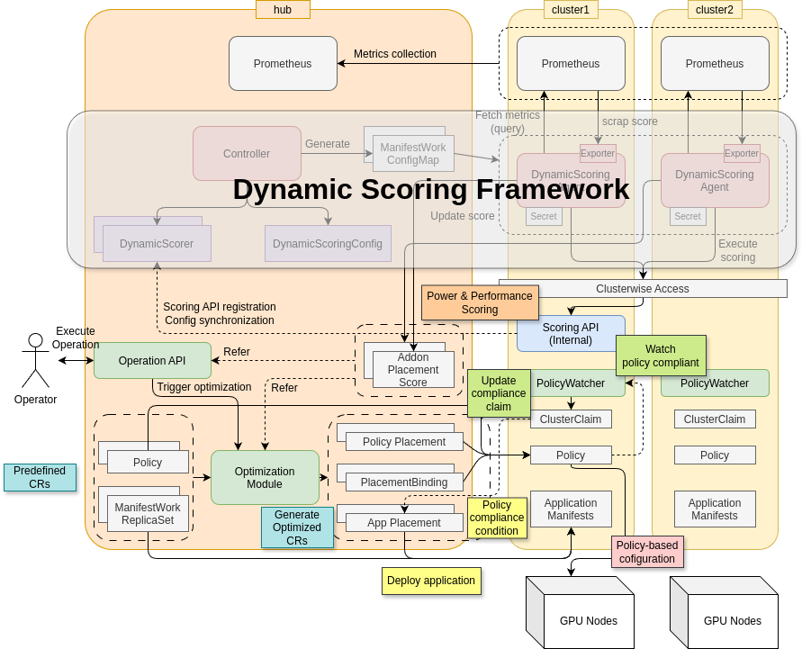
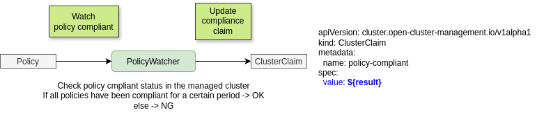
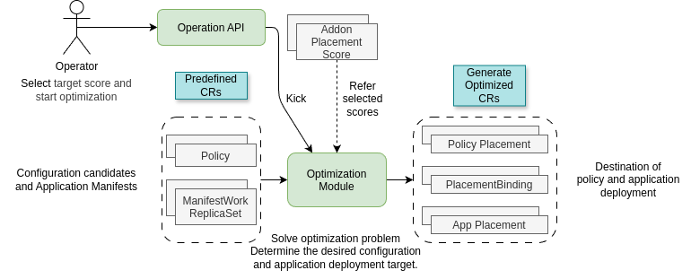
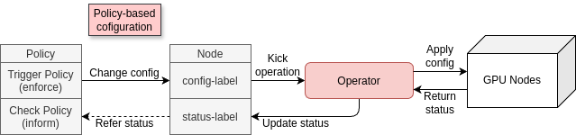
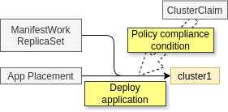

# Optimization Using Dynamic Scoring Framework (DSF)

The Dynamic Scoring Framework (DSF) provides periodic scoring and centralized storage of scoring results, enabling optimization of workloads based on real-time performance metrics. This document outlines how to leverage DSF for optimization purposes.

## Prerequisites

- A running DSF instance with configured scoring endpoints.
  - In this example we use `sample/ai-workload-scorer` which provides performance and power consumption scores based on GPU configurations.
- Access to the DSF API for retrieving scores.

In this architecture, we assume that OCM Policy Framework is set up to manage policies and trigger optimization actions based on the scores provided by DSF.

### Policy Framework Installation

OCM Policy Framework can install via `clusteradm` CLI. It provides a set of controllers for managing policies across clusters.

```sh
export CTX_HUB_CLUSTER=kind-hub01
clusteradm install hub-addon --names governance-policy-framework --context ${CTX_HUB_CLUSTER}

clusteradm addon enable --names governance-policy-framework --clusters worker01 --context ${CTX_HUB_CLUSTER}
clusteradm addon enable --names governance-policy-framework --clusters worker02 --context ${CTX_HUB_CLUSTER}
clusteradm addon enable --names config-policy-controller --clusters worker01 --context ${CTX_HUB_CLUSTER}
clusteradm addon enable --names config-policy-controller --clusters worker02 --context ${CTX_HUB_CLUSTER}
```

### MWRS Installation

ManifestWorkReplicaSet (MWRS) is a feature that allows distributing workloads across multiple clusters based on placement decisions. It can be enabled in the ClusterManager configuration.

```yaml
kind: ClusterManager
metadata:
  name: cluster-manager
spec:
   ...
  workConfiguration:
    featureGates:
    - feature: ManifestWorkReplicaSet
      mode: Enable
```


## Architecture Overview




## Build and Deploy PolicyWatcher

Build and deploy the PolicyWatcher to each worker cluster. This component monitors policy compliance status:

```bash
podman build -t quay.io/dynamic-scoring/policy-watcher:v0.1.0 samples/policy-watcher
kind load docker-image quay.io/dynamic-scoring/policy-watcher:v0.1.0 --name worker01
kind load docker-image quay.io/dynamic-scoring/policy-watcher:v0.1.0 --name worker02
CLUSTER_NAME=worker01 envsubst < samples/policy-watcher/deployment.yaml | kubectl delete -f - --context kind-worker01
CLUSTER_NAME=worker01 envsubst < samples/policy-watcher/deployment.yaml | kubectl apply -f - --context kind-worker01
CLUSTER_NAME=worker02 envsubst < samples/policy-watcher/deployment.yaml | kubectl delete -f - --context kind-worker02
CLUSTER_NAME=worker02 envsubst < samples/policy-watcher/deployment.yaml | kubectl apply -f - --context kind-worker02
```

Verify that PolicyWatcher is running and has created ClusterClaims:

```bash
$ kubectl get clusterclaims policy-watcher-claim --context kind-worker01 -o yaml|grep value:
  value: empty
$ kubectl get clusterclaims policy-watcher-claim --context kind-worker02 -o yaml|grep value:
  value: empty
```

The PolicyWatcher will update the ClusterClaim value based on the compliance status of policies in each cluster. This information can be used by OCM to make informed decisions about workload placement and optimization.



## Deploy Operation API Server

The Operation API Server provides an interface for OCM to retrieve scores and make optimization decisions.



```bash
podman build -t quay.io/dynamic-scoring/dynamic-scoring-framework-mcp:latest samples/dynamic-scoring-framework-mcp
kind load docker-image quay.io/dynamic-scoring/dynamic-scoring-framework-mcp:latest --name hub01
kubectl apply -f samples/dynamic-scoring-framework-mcp/deployment.yaml --context kind-hub01
kubectl port-forward -n dynamic-scoring pod/$(kubectl get pods -n dynamic-scoring -l app=dynamic-scoring-framework-mcp --context kind-hub01 -o name | head -1 | cut -d/ -f2) 8338:8338 --context kind-hub01
```

## Prepare Optimization

Deploy sample MWRS and Policies.

```bash
$ oc apply -f samples/dynamic-scoring-framework-mcp/manifests/
manifestworkreplicaset.work.open-cluster-management.io/mwrs-app01 created
manifestworkreplicaset.work.open-cluster-management.io/mwrs-app02 created
policy.policy.open-cluster-management.io/policy-disable-mig-worker01 created
policy.policy.open-cluster-management.io/policy-disable-mig-worker02 created
policy.policy.open-cluster-management.io/policy-enable-mig-3g-worker01 created
policy.policy.open-cluster-management.io/policy-enable-mig-2g-worker02 created
policy.policy.open-cluster-management.io/policy-enable-mig-2g-worker01 created
policy.policy.open-cluster-management.io/policy-enable-mig-3g-worker02 created
```

MWRSs are sample applications to be deployed to each worker cluster. They have resource requests for GPU. The labels indicate the GPU demands.

```yaml
apiVersion: work.open-cluster-management.io/v1alpha1
kind: ManifestWorkReplicaSet
metadata:
  name: mwrs-app01
  namespace: default
  labels:
    app: "app01"
    resource-request-kind: "gpu"
    resource-request-amount: "2"
```

And policies are created to enable/disable MIG settings on each worker cluster.
The labels indicate the GPU supply information when this policy is applied to the cluster.

```yaml
apiVersion: policy.open-cluster-management.io/v1
kind: Policy
metadata:
  name: policy-disable-mig-worker01
  namespace: default
  labels:
    resource-supply-kind: "gpu"
    resource-supply-amount: "1"
    resource-supply-device: "all"
```

**Note**: In this use case example, each policy spec has 2 policy-templates:
1. **First template**: Sets the `migsettinglabel` on nodes (enforce mode)
2. **Second template**: Ensures the `migresultlabel` is set when configuration is ready

These labels mock the behavior of GPU Operator's MIG controller.



In this example, resource supply amount and demand amount are represented as the number of GPUs and resource arrangement must satisfy capacity constraints.

This policies are watched by the PolicyWatcher and placement for applications will be decided based on the compliance status of these policies.



Finally, label the ManagedClusters for easier placement selection:

```bash
$ oc label managedcluster worker01 cluster-name=worker01
managedcluster.cluster.open-cluster-management.io/worker01 labeled
$ oc label managedcluster worker02 cluster-name=worker02
managedcluster.cluster.open-cluster-management.io/worker02 labeled
```

## Execute Optimization

### Create Optimization Parameters

Create the optimization parameter file `samples/dynamic-scoring-framework-mcp/examples/params.json`. This file defines:
- **clusters**: Available clusters and their policy options
- **targetWorkloads**: Applications (MWRS) to be placed
- **preference**: Which AddOnPlacementScore to optimize for

```json
{
  "namespace": "default",
  "clusters": [
    {
      "name": "worker01",
      "availablePolicies": [
        {
          "name": "policy-enable-mig-2g-worker01"
        },
        {
          "name": "policy-enable-mig-3g-worker01"
        },
        {
          "name": "policy-disable-mig-worker01"
        }
      ]
    },
    {
      "name": "worker02",
      "availablePolicies": [
        {
          "name": "policy-enable-mig-2g-worker02"
        },
        {
          "name": "policy-enable-mig-3g-worker02"
        },
        {
          "name": "policy-disable-mig-worker02"
        }
      ]
    }
  ],
  "targetWorkloads": [
    {
      "name": "mwrs-app01"
    },
    {
      "name": "mwrs-app02"
    }
  ],
  "preference": {
    "addOnPlacementScore": "example-performance-score",
    "scoreDimensionFormat": "${app};${device}"
  }
}
```

### Run Manual Optimization

```bash
curl -X POST http://localhost:8338/optimize \
  -H "Content-Type: application/json" \
  -d @samples/dynamic-scoring-framework-mcp/examples/params.json | jq > tmp/optimize-result.json
```

As a result, you can get 2 placements for policy attachment and 2 placement for MWRS deployment.

```bash
$ oc get placements -n default
NAME                          SUCCEEDED   REASON                    SELECTEDCLUSTERS
app01-placement               False       NoManagedClusterMatched   
app02-placement               False       NoManagedClusterMatched   
placement-worker01-b7552597   True        AllDecisionsScheduled     1
placement-worker02-b7552597   True        AllDecisionsScheduled     1
```

Policy is attached to each cluster.

```bash
$ oc get policies -n worker01
NAME                                    REMEDIATION ACTION   COMPLIANCE STATE   AGE
default.policy-enable-mig-3g-worker01                        NonCompliant       2m9s
$ oc get policies -n worker02
NAME                                    REMEDIATION ACTION   COMPLIANCE STATE   AGE
default.policy-enable-mig-3g-worker02                        NonCompliant       7m31s
$ oc get node --context kind-worker01 -o yaml | grep mig
      migsettinglabel: 3g.48gb
$ oc get node --context kind-worker02 -o yaml | grep mig
      migsettinglabel: 3g.48gb
```

### Simulate Policy Compliance

In a real environment, the GPU Operator would set the `migresultlabel` when MIG configuration is complete. For this demo, set it manually:

```bash
$ oc label node worker01-control-plane migresultlabel=true --context kind-worker01
node/worker01-control-plane labeled
$ oc label node worker02-control-plane migresultlabel=true --context kind-worker02
node/worker02-control-plane labeled
```

Verify the MIG labels on nodes:

```bash
$ oc get node --context kind-worker01 -o yaml | grep mig
      migresultlabel: "true"
      migsettinglabel: 3g.48gb
$ oc get node --context kind-worker02 -o yaml | grep mig
      migresultlabel: "true"
      migsettinglabel: 3g.48gb
```

Check that policies are now compliant:

```bash
$ oc get policies -n worker01
NAME                                    REMEDIATION ACTION   COMPLIANCE STATE   AGE
default.policy-enable-mig-3g-worker01                        Compliant          39m
$ oc get policies -n worker02
NAME                                    REMEDIATION ACTION   COMPLIANCE STATE   AGE
default.policy-enable-mig-3g-worker02                        Compliant          39m
```

### Verify Workload Placement

Once policies are compliant, the workload placements will succeed:

```bash
$ oc get placements -n default
NAME                          SUCCEEDED   REASON                  SELECTEDCLUSTERS
app01-placement               True        AllDecisionsScheduled   1
app02-placement               True        AllDecisionsScheduled   1
placement-worker01-b7552597   True        AllDecisionsScheduled   1
placement-worker02-b7552597   True        AllDecisionsScheduled   1
```

Reset generated placements and placementbindings for next optimization.

```bash
$ kubectl delete placements -n default -l "dynamic-scoring-framework-mcp/generated=true" --context kind-hub01
placement.cluster.open-cluster-management.io "app01-placement" deleted
placement.cluster.open-cluster-management.io "app02-placement" deleted
placement.cluster.open-cluster-management.io "placement-worker01-b7552597" deleted
placement.cluster.open-cluster-management.io "placement-worker02-b7552597" deleted
$ kubectl delete placementbindings -n default -l "dynamic-scoring-framework-mcp/generated=true" --context kind-hub01
placementbinding.policy.open-cluster-management.io "binding-worker01-b7552597" deleted
placementbinding.policy.open-cluster-management.io "binding-worker02-b7552597" deleted
```

This removes all optimization-generated resources, allowing you to run a new optimization with different preferences.

### Optimize for Power Consumption

Now run optimization with a different objective. Change the preference in `params.json` to optimize for power consumption instead of performance:

```json
{
  "namespace": "default",
  "clusters": [
    {
      "name": "worker01",
      "availablePolicies": [
        {
          "name": "policy-enable-mig-2g-worker01"
        },
        {
          "name": "policy-enable-mig-3g-worker01"
        },
        {
          "name": "policy-disable-mig-worker01"
        }
      ]
    },
    {
      "name": "worker02",
      "availablePolicies": [
        {
          "name": "policy-enable-mig-2g-worker02"
        },
        {
          "name": "policy-enable-mig-3g-worker02"
        },
        {
          "name": "policy-disable-mig-worker02"
        }
      ]
    }
  ],
  "targetWorkloads": [
    {
      "name": "mwrs-app01"
    },
    {
      "name": "mwrs-app02"
    }
  ],
  "preference": {
    "addOnPlacementScore": "example-powerconsumption-score",
    "scoreDimensionFormat": "${app};${device}"
  }
}
```

**Key Change**: `addOnPlacementScore` is now set to `example-powerconsumption-score` instead of performance.

Run the optimization again:

```bash
curl -X POST http://localhost:8338/optimize \
  -H "Content-Type: application/json" \
  -d @samples/dynamic-scoring-framework-mcp/examples/params.json | jq > tmp/optimize-result.json
```

The optimization will now select different GPU configurations that minimize power consumption.

### Observe Different Optimization Results

Check the MIG settings. Notice that different policies are now selected (2g.24gb instead of 3g.48gb):

```bash
$ oc get node --context kind-worker01 -o yaml | grep mig
      migresultlabel: "true"
      migsettinglabel: 2g.24gb
$ oc get node --context kind-worker02 -o yaml | grep mig
      migresultlabel: "true"
      migsettinglabel: 2g.24gb
```

**Analysis**:
- **Performance optimization**: Selected 3g.48gb (higher GPU slices, better performance)
- **Power optimization**: Selected 2g.24gb (smaller GPU slices, lower power consumption)

This demonstrates the power/performance tradeoff inherent in the scoring system.

Follow the same steps as before to mark policies compliant and verify workload placement.

After stable time window, verify compliance status and placement results as above.

```bash
$ oc get placements -n default
NAME                          SUCCEEDED   REASON                  SELECTEDCLUSTERS
app01-placement               True        AllDecisionsScheduled   1
app02-placement               True        AllDecisionsScheduled   1
placement-worker01-1f3306ad   True        AllDecisionsScheduled   1
placement-worker02-1f3306ad   True        AllDecisionsScheduled   1
```

All placements are successfully scheduled with the power-optimized configuration.

---

### Integrate MCP with VSCode Copilot

The Dynamic Scoring Framework MCP server provides AI-assisted optimization through VS Code Copilot. This enables natural language interaction with the optimization API.

Configure VS Code to use the MCP server by editing `.vscode/mcp.json`:

```json
{
	"servers": {
		"dynamic-scoring-framework-mcp": {
			"url": "http://localhost:8338/mcp",
			"type": "http"
		}
	},
	"inputs": []
}
```

With this configuration, you can use VS Code Copilot to:
- Query AddOnPlacementScores with natural language
- Run optimization with conversational commands
- Explore scoring data interactively

Example prompts:
- "Please get AddOnPlacementScores and summarize them"
- "Optimize for performance"
- "Optimize for power consumption"