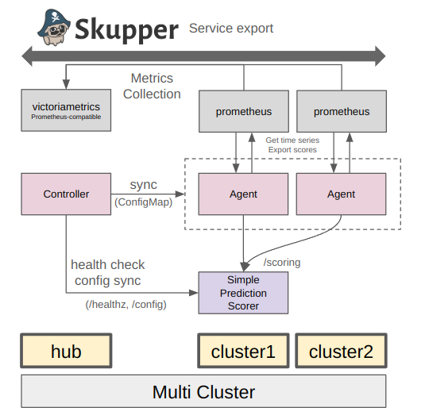
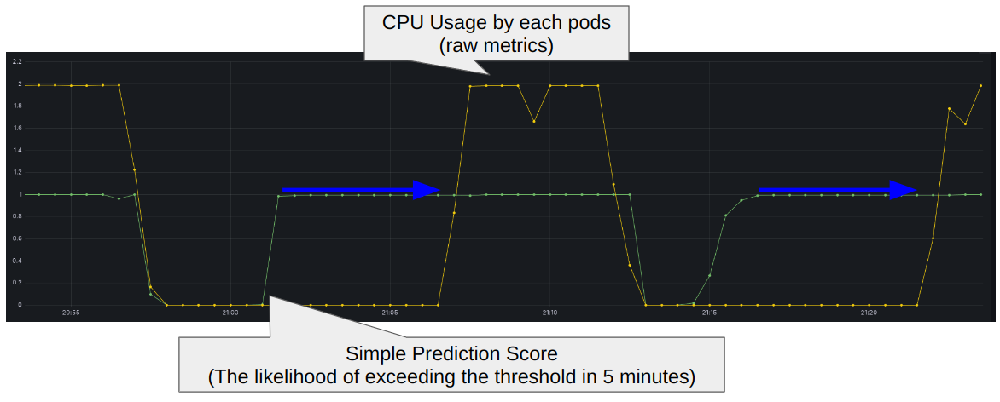

# Example DynamicScoring Usecase

## Overview

### For internal scoring API: Skupper

This example demonstrates how to set up a local development environment for the DynamicScoring Framework using kind clusters (hub, cluster1, cluster2) and OCM. It includes steps for building and deploying the Addon Agent and CR Controller, as well as setting up Skupper for cross-cluster communication.

### Prediction Scoring

Prediction scoring is a use case where the DynamicScoring Framework is used to evaluate and score predictions made by various models across multiple clusters. This framework allows for dynamic scoring of these predictions based on metrics collected from Prometheus.

The Simple Prediction Scorer is a scoring API that takes CPU usage as input and predicts CPU usage 5 minutes into the future. It returns a score close to 1 if the predicted value is likely to exceed a predefined threshold.

