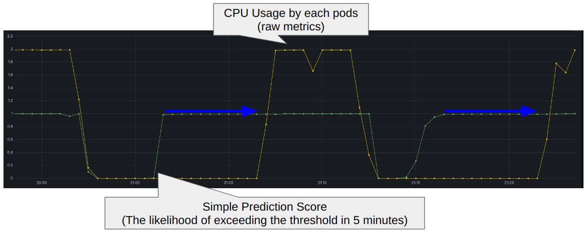

# Simple Prediction Scorer

An internal Scoring API that takes CPU usage time series data as input, trains a linear regression model using [Darts](https://unit8co.github.io/darts/), and predicts CPU usage several steps into the future.  
It returns a score close to 100 if the predicted value is likely to exceed a predefined threshold, enabling proactive workload placement decisions.

> For an overview of all available Scoring API samples, see [docs/scoring-api-samples.md](../../docs/scoring-api-samples.md).



## Directory Structure

```
simple-prediction-scorer/
├── Dockerfile                    # Container image definition
├── README.md                     # This file
├── app/
│   ├── main.py                   # FastAPI application entry point
│   ├── get_metrics.py            # Utility to fetch metrics from Prometheus for testing
│   ├── models/                   # Trained model files (.pth), auto-created at runtime
│   └── schemas/
│       ├── config.py             # Pydantic schemas for /config response
│       └── scoring.py            # Pydantic schemas for /scoring request/response
├── hack/
│   └── test_scoring.sh           # Script to test the scoring endpoint
├── manifests/
│   ├── manifestwork.yaml         # OCM ManifestWork for deploying to managed clusters
│   ├── simple-prediction-scorer.yaml  # Kubernetes Deployment/Service manifest
│   └── cpu-load-generator.yaml   # Sample workload to generate CPU load for testing
└── static/
    └── sample_cpu_load.json      # Sample time series data for testing
```

## Endpoints

| Method | Path | Description |
|--------|------|-------------|
| `GET` | `/config` | Returns the scorer configuration (source, scoring params) |
| `POST` | `/scoring` | Accepts time series data, runs prediction, and returns scores |
| `POST` | `/reset` | Removes all trained model files to force re-training |
| `GET` | `/healthz` | Health check endpoint |

## Environment Variables

| Variable | Default | Description |
|----------|---------|-------------|
| `MODEL_DIR` | `models` | Directory to store trained model files |
| `MIN_LENGTH` | `20` | Minimum number of data points required for prediction |
| `HORIZON_LENGTH` | `10` | Number of future steps to predict |
| `VALIDATION_LENGTH` | `10` | Number of data points used for validation |
| `THRESHOLD` | `1` | CPU usage threshold for scoring (sigmoid midpoint) |
| `ALPHA` | `20` | Sigmoid steepness parameter |
| `MAX_RMSE_THRESHOLD` | `20` | RMSE threshold to trigger model re-training |

## Quick Start (podman)

### Build

```bash
cd samples/simple-prediction-scorer
podman build -t simple-prediction-scorer .
```

### Run

```bash
podman run -d -p 8000:8000 --name simple-prediction-scorer --replace simple-prediction-scorer
```

### Test

Check the configuration:

```bash
curl -sS http://localhost:8000/config | jq
```

Send sample scoring data:

```bash
curl -sS -X POST http://localhost:8000/scoring \
  -H "Content-Type: application/json" \
  -d @static/sample_cpu_load.json | jq
```

Reset trained models:

```bash
curl -sS -X POST http://localhost:8000/reset | jq
```

## How It Works

1. The `/scoring` endpoint receives time series data (timestamp + CPU value pairs per pod).
2. For each series with enough data points (≥ `MIN_LENGTH`):
   - A `LinearRegressionModel` (Darts) is loaded from disk if a trained model exists, otherwise a new model is trained.
   - If the existing model's RMSE exceeds `MAX_RMSE_THRESHOLD`, the model is automatically re-trained.
   - The model predicts `HORIZON_LENGTH` steps into the future.
3. The maximum predicted value is passed through a sigmoid function:  
   $\text{score} = \frac{100}{1 + e^{-\alpha \cdot (\text{max\_val} - \text{threshold})}}$
4. A score close to **100** means the predicted CPU usage is likely to exceed the threshold; a score close to **0** means it is well below.

## Deploy to Managed Cluster (via OCM ManifestWork)

```bash
export SIMPLE_PREDICTION_SCORER_IMAGE_NAME=quay.io/dynamic-scoring/simple-prediction-scorer:latest
podman tag localhost/simple-prediction-scorer:latest $SIMPLE_PREDICTION_SCORER_IMAGE_NAME
kind load docker-image $SIMPLE_PREDICTION_SCORER_IMAGE_NAME --name cluster2
CLUSTER_NAME=cluster2 envsubst < manifests/manifestwork.yaml | kubectl apply -f - --context kind-hub
```

## Configuration

The scorer exposes the following configuration via `/config`:

```json
{
  "name": "simple-prediction-scorer",
  "description": "A simple prediction score for time series data",
  "source": {
    "type": "Prometheus",
    "host": "http://kube-prometheus-kube-prome-prometheus.monitoring.svc:9090",
    "path": "/api/v1/query_range",
    "params": {
      "query": "sum by (node, namespace, pod) (rate(container_cpu_usage_seconds_total{container!=\"\", pod!=\"\"}[1m]))",
      "range": 3600,
      "step": 30
    }
  },
  "scoring": {
    "path": "/scoring",
    "params": {
      "name": "simple_prediction_score",
      "interval": 30
    }
  }
}
```
