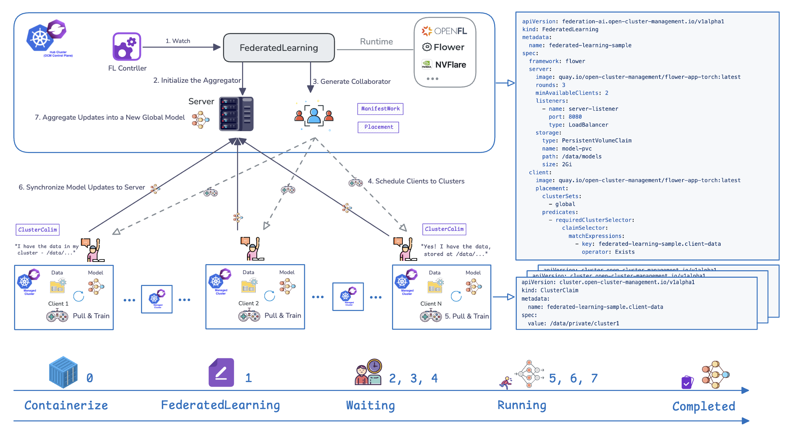

# Federated Learning Controller for Open Cluster Management

As machine learning (ML) evolves, protecting data privacy becomes increasingly important. Since ML depends on large volumes of data, it's essential to secure that data without disrupting the learning process.

Federated Learning (FL) addresses this by allowing multiple clusters or organizations to collaboratively train models without sharing sensitive data. Computation happens where the data lives, ensuring privacy, regulatory compliance, and efficiency.

This Kubernetes controller automates the deployment and management of federated learning within an Open Cluster Management (OCM) environment, which provides an effective foundation for federated learning [Learn more](./docs/why-fl-in-ocm.md). The FederatedLearning CRD offers a unified, open interface for frameworks such as Flower, OpenFL, and Others, leveraging Kubernetes-native resources to coordinate servers, clients, and training across multicluster environments.



--- 

## Getting Started

### Prerequisites

Ensure the following tools are installed:

- [`kubectl`](https://kubernetes.io/docs/reference/kubectl/)
- [`kustomize`](https://kubectl.docs.kubernetes.io/installation/kustomize/)
- [`kind`](https://kind.sigs.k8s.io/) (version > v0.9.0 recommended)
- [`make`](https://www.gnu.org/software/make/) for build automation

Optional (for container image building):

- Podman or Docker
- Go (version 1.19 or later)

--- 

### Set Up the Environment

#### 1. Install `clusteradm`

```bash
curl -L https://raw.githubusercontent.com/open-cluster-management-io/clusteradm/main/install.sh | bash
```

#### 2. Create hub and managed clusters with `kind`

```bash
curl -L https://raw.githubusercontent.com/open-cluster-management-io/OCM/main/solutions/setup-dev-environment/local-up.sh | bash
```

#### 3. Verify cluster setup

```bash
$ kubectl get mcl
NAME       HUB ACCEPTED   MANAGED CLUSTER URLS                  JOINED   AVAILABLE   AGE
cluster1   true           https://cluster1-control-plane:6443   True     True        2m
cluster2   true           https://cluster2-control-plane:6443   True     True        3m
```

#### Optional: Configure Environment for Observability

Please refer to the [Observability Setup](docs/configure-environment-observability.md) documentation for more details.

--- 

### Deploy Federated Learning Controller

#### 1. Clone and navigate to the repository

```bash
git clone git@github.com:open-cluster-management-io/addon-contrib.git
cd ./addon-contrib/federated-learning-controller
```

#### 2. Deploy the controller to the hub cluster

Use the pre-built image `quay.io/open-cluster-management/federated-learning-controller:latest`:

```bash
kubectl config use-context kind-hub
make deploy IMG=quay.io/open-cluster-management/federated-learning-controller:latest NAMESPACE=open-cluster-management
```

<details>

<summary><strong>Alternatively: Build and Use Your Own Controller Image</strong></summary>

  **Build and push the controller image:**

  ```bash
  make docker-build docker-push IMG=<your-registry>/federated-learning-controller:<your-tag>
  ```

  **Deploy with your custom image:**

  ```bash
  kubectl config use-context kind-hub
  make deploy IMG=<your-registry>/federated-learning-controller:<your-tag> NAMESPACE=open-cluster-management
  ```
</details>

> **NOTE**: If you encounter RBAC errors, you may need to grant yourself cluster-admin
privileges or be logged in as admin.

#### 3. Verify the deployment

```bash
$ kubectl get pods -n open-cluster-management
NAME                                            READY   STATUS      RESTARTS   AGE
cluster-manager-d9db64db5-c7kfj                 1/1     Running     0          5m
cluster-manager-d9db64db5-t7grh                 1/1     Running     0          5m
cluster-manager-d9db64db5-wndd8                 1/1     Running     0          5m
federated-learning-controller-d7df846c9-nb4wc   1/1     Running     0          3m
```

<details>

<summary><strong>Alternatively: Run the Controller Locally</strong></summary>

  **Install the CRDs into the cluster:**

  ```sh
  make install
  ```

  **Run the controller locally:**

  ```sh
  make run
  ```
</details>

--- 

### Deploy the Federated Learning Instance

#### 1. Deploy a Federated Learning Instance

In this example, both the server and clients use the pre-built image `quay.io/open-cluster-management/federated-learning-application:flower-mnist-latest`. Once the resource is created, the server is deployed to the hub cluster, and the clients are prepared for deployment to the managed clusters.

Create a `FederatedLearning` resource in the controller namespace on the hub cluster:

```yaml
apiVersion: federation-ai.open-cluster-management.io/v1alpha1
kind: FederatedLearning
metadata:
  name: federated-learning-sample
spec:
  framework: flower
  server:
    image: quay.io/open-cluster-management/federated-learning-application:flower-mnist-latest
    rounds: 3
    minAvailableClients: 2
    listeners:
      - name: server-listener
        port: 8080
        type: NodePort
    storage:
      type: PersistentVolumeClaim # switch to S3Bucket for S3-backed static volumes
      name: model-pvc
      path: /data/models
      size: 2Gi
      # s3:
      #   bucketName: <your-bucket-name>
      #   region: us-east-1
      #   prefix: optional/prefix/
  client:
    image: quay.io/open-cluster-management/federated-learning-application:flower-mnist-latest
    placement:
      clusterSets:
        - global
      predicates:
        - requiredClusterSelector:
            claimSelector:
              matchExpressions:
                - key: federated-learning-sample.client-data
                  operator: Exists
```

> **Note**: Only `NodePort` is supported in KinD clusters.

<details>

<summary><strong>Alternatively: Build and Use Your Own Application Image</strong></summary>

If you want to customize the federated learning application, you can build your own image:

  **Navigate to the flower example directory:**

  ```bash
  cd examples/flower
  ```

  **Build and push the application image:**

  ```bash
  export IMAGE_REGISTRY=<your-registry>
  export IMAGE_TAG=<your-tag>
  export APP_NAME=flower-mnist
  make build-app-image
  make push-app-image
  ```

  This will create an image with the format: `<IMAGE_REGISTRY>/federated-learning-application:<APP_NAME>-<IMAGE_TAG>`

  **Update the YAML with your custom image:**

  Replace the `image` fields in both `server` and `client` sections with your custom image reference.

  For more details on containerized federated learning applications, see: [Flower PyTorch App](./examples/flower/Makefile)

</details>

#### 2. Schedule the Federated Learning Clients into Managed Clusters

The above configuration schedules only clusters with a `ClusterClaim` having the key `federated-learning-sample.client-data`. You can combine this with other scheduling policies (refer to the Placement API for details).

Add the `ClusterClaim` to these clusters own the data for the client:

**Cluster1:**

```yaml
apiVersion: cluster.open-cluster-management.io/v1alpha1
kind: ClusterClaim
metadata:
  name: federated-learning-sample.client-data
spec:
  value: /data/private/cluster1
```

**Cluster2:**

```yaml
apiVersion: cluster.open-cluster-management.io/v1alpha1
kind: ClusterClaim
metadata:
  name: federated-learning-sample.client-data
spec:
  value: /data/private/cluster2
```

#### 3. Check the Federated Learning Instance Status

- After creating the instance, the server initially shows a status of `Waiting`

  Example - server in hub cluster:

  ```bash
  $ kubectl get pods
  NAME                                            READY   STATUS      RESTARTS   AGE
  federated-learning-sample-server-7jnfs          0/1     Completed   0          10m
  ```

- Once the required clients are ready, status changes to `Running`

  Example - client in managed cluster

  ```bash
  $ kubectl get pods -n open-cluster-management
  NAME                                     READY   STATUS      RESTARTS   AGE
  federated-learning-sample-client-75sc8   0/1     Completed   0          10m
  ```

- After the training and aggregation rounds complete, the status becomes `Completed`

  Example - Federated Learning instance:

  ```yaml
  status:
    listeners:
    - address: 172.18.0.2:31166
      name: listener(service):federated-learning-sample-server
      port: 31166
      type: NodePort
    message: Model training successful. Check storage for details
    phase: Completed
  ```

#### 4. Download and Verify the Trained Model

The trained model is saved in the `model-pvc` volume.

- [Deploy a Jupyter notebook server](./examples/notebooks/deploy)
- [Validate the model](./examples/notebooks/1.hub-evaluation.ipynb)

--- 

### To Uninstall

**Delete the instances (CRs) from the cluster:**

```sh
kubectl delete -k config/samples/
```

**Delete the APIs(CRDs) from the cluster:**

```sh
make uninstall
```

**UnDeploy the controller from the cluster:**

```sh
make undeploy
```
