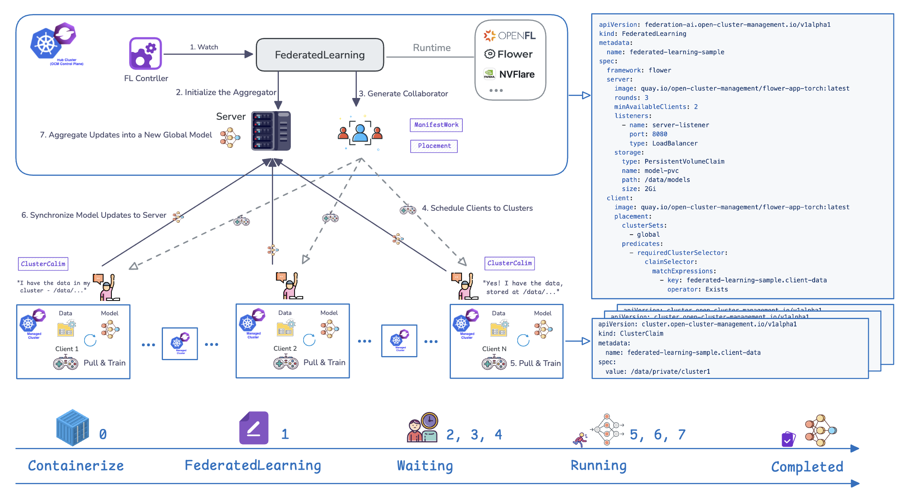

# Federated Learning Controller for Open Cluster Management

As machine learning (ML) evolves, protecting data privacy becomes increasingly important. Since ML depends on large volumes of data, it's essential to secure that data without disrupting the learning process.

Federated Learning (FL) addresses this by allowing multiple clusters or organizations to collaboratively train models without sharing sensitive data. Computation happens where the data lives, ensuring privacy, regulatory compliance, and efficiency.

This Kubernetes controller automates the deployment and management of federated learning within an Open Cluster Management (OCM) environment, which provides an effective foundation for federated learning [Learn more](./docs/why-fl-in-ocm.md). The FederatedLearning CRD offers a unified, open interface for frameworks such as Flower, OpenFL, and Others, leveraging Kubernetes-native resources to coordinate servers, clients, and training across multicluster environments.



---

## Architecture

### Flower 2.x (SuperLink/SuperNode)

The Flower path leverages the [Flower Addon](../flower-addon/) to pre-deploy the SuperLink/SuperNode infrastructure. The controller deploys only the application layer on top:

```
Hub Cluster:
  ├── SuperLink (pre-deployed by Flower Addon)
  ├── SuperExec-ServerApp Deployment (deployed by FederatedLearning Controller)
  │   └── connects to SuperLink exec API (port 9091)
  └── FederatedLearning Controller

Managed Clusters:
  ├── SuperNode (pre-deployed by Flower Addon)
  └── SuperExec-ClientApp Deployment (deployed via ManifestWorkReplicaSet)
      └── connects to SuperNode ClientAppIO API (port 9094)
```

- **ServerApp** is deployed as a Deployment on the hub cluster, connecting to the SuperLink exec API.
- **ClientApp** is deployed to managed clusters via a single ManifestWorkReplicaSet, which automatically handles cluster adds/removes through OCM Placement.

### OpenFL

The OpenFL path manages the full server/client lifecycle using Jobs, Services, and per-cluster ManifestWorks.

---

## Getting Started

### Prerequisites

Ensure the following tools are installed:

- [`kubectl`](https://kubernetes.io/docs/reference/kubectl/)
- [`kustomize`](https://kubectl.docs.kubernetes.io/installation/kustomize/)
- [`kind`](https://kind.sigs.k8s.io/) (version > v0.9.0 recommended)
- [`make`](https://www.gnu.org/software/make/) for build automation

Optional (for container image building):

- Podman or Docker
- Go (version 1.23 or later)

---

### Set Up the Environment

#### 1. Install `clusteradm`

```bash
curl -L https://raw.githubusercontent.com/open-cluster-management-io/clusteradm/main/install.sh | bash
```

#### 2. Create hub and managed clusters with `kind`

```bash
curl -L https://raw.githubusercontent.com/open-cluster-management-io/OCM/main/solutions/setup-dev-environment/local-up.sh | bash
```

#### 3. Verify cluster setup

```bash
$ kubectl get mcl
NAME       HUB ACCEPTED   MANAGED CLUSTER URLS                  JOINED   AVAILABLE   AGE
cluster1   true           https://cluster1-control-plane:6443   True     True        2m
cluster2   true           https://cluster2-control-plane:6443   True     True        3m
```

#### 4. Deploy the Flower Addon (required for Flower framework)

The Flower addon pre-deploys SuperLink on the hub and SuperNode on managed clusters:

```bash
cd ../flower-addon
make deploy
make enable-addon CLUSTER=cluster1
make enable-addon CLUSTER=cluster2
```

Verify the addon is running:

```bash
$ kubectl get pods -n flower-system
NAME                         READY   STATUS    RESTARTS   AGE
superlink-c8d95648d-6vdv8    1/1     Running   0          1m

$ kubectl get managedclusteraddons -A | grep flower
cluster1    flower-addon   True
cluster2    flower-addon   True
```

#### Optional: Configure Environment for Observability

Please refer to the [Observability Setup](docs/configure-environment-observability.md) documentation for more details.

---

### Deploy Federated Learning Controller

#### 1. Clone and navigate to the repository

```bash
git clone git@github.com:open-cluster-management-io/addon-contrib.git
cd ./addon-contrib/federated-learning-controller
```

#### 2. Deploy the controller to the hub cluster

Use the pre-built image `quay.io/open-cluster-management/federated-learning-controller:latest`:

```bash
kubectl config use-context kind-hub
make deploy IMG=quay.io/open-cluster-management/federated-learning-controller:latest NAMESPACE=open-cluster-management
```

<details>

<summary><strong>Alternatively: Build and Use Your Own Controller Image</strong></summary>

  **Build and push the controller image:**

  ```bash
  make docker-build docker-push IMG=<your-registry>/federated-learning-controller:<your-tag>
  ```

  **Deploy with your custom image:**

  ```bash
  kubectl config use-context kind-hub
  make deploy IMG=<your-registry>/federated-learning-controller:<your-tag> NAMESPACE=open-cluster-management
  ```
</details>

> **NOTE**: If you encounter RBAC errors, you may need to grant yourself cluster-admin
privileges or be logged in as admin.

#### 3. Verify the deployment

```bash
$ kubectl get pods -n open-cluster-management
NAME                                            READY   STATUS      RESTARTS   AGE
cluster-manager-d9db64db5-c7kfj                 1/1     Running     0          5m
cluster-manager-d9db64db5-t7grh                 1/1     Running     0          5m
cluster-manager-d9db64db5-wndd8                 1/1     Running     0          5m
federated-learning-controller-d7df846c9-nb4wc   1/1     Running     0          3m
```

<details>

<summary><strong>Alternatively: Run the Controller Locally</strong></summary>

  **Install the CRDs into the cluster:**

  ```sh
  make install
  ```

  **Run the controller locally:**

  ```sh
  make run
  ```
</details>

---

### Deploy a Federated Learning Instance (Flower)

#### 1. Create a FederatedLearning Resource

The Flower path requires the Flower addon to be installed. The controller deploys a SuperExec-ServerApp on the hub and SuperExec-ClientApp Deployments on managed clusters via ManifestWorkReplicaSet.

```yaml
apiVersion: federation-ai.open-cluster-management.io/v1alpha1
kind: FederatedLearning
metadata:
  name: federated-learning-sample
spec:
  framework: flower
  server:
    image: quay.io/open-cluster-management/flower-app:cifar10-v1.0.0
    minAvailableClients: 2
    # superlink: superlink.flower-system:9091  # default, can be omitted
  client:
    image: quay.io/open-cluster-management/flower-app:cifar10-v1.0.0
    # supernode: flower-supernode.flower-addon:9094  # default, can be omitted
    placement:
      clusterSets:
        - global
      predicates:
        - requiredClusterSelector:
            labelSelector:
              matchLabels:
                feature.open-cluster-management.io/addon-flower-addon: available
```

Key fields:

| Field | Description | Default |
|-------|-------------|---------|
| `server.superlink` | SuperLink exec API endpoint | `superlink.flower-system:9091` |
| `client.supernode` | SuperNode ClientAppIO API endpoint | `flower-supernode.flower-addon:9094` |
| `server.minAvailableClients` | Minimum clusters required before training starts | - |
| `client.placement` | OCM Placement spec for cluster selection | - |

#### 2. Check the Federated Learning Instance Status

After creating the resource, the controller transitions through phases:

- **Waiting**: Placement is created, waiting for enough clusters to be selected.
- **Running**: ServerApp and ClientApp are deployed. The CR stays in `Running` until deleted.

```bash
$ kubectl get fl
NAME                        PHASE     AGE
federated-learning-sample   Running   30s
```

Verify the resources:

```bash
# ServerApp Deployment on hub
$ kubectl get deployments
NAME                                  READY   UP-TO-DATE   AVAILABLE   AGE
federated-learning-sample-serverapp   1/1     1            1           30s

# ManifestWorkReplicaSet for client distribution
$ kubectl get manifestworkreplicasets
NAME                                  PLACEMENT                     FOUND   MANIFESTWORKS   APPLIED
federated-learning-sample-clientapp   federated-learning-sample     True    AsExpected       True

# ClientApp Deployments on managed clusters
$ kubectl get deployments --context kind-cluster1 -n flower-addon
NAME                                  READY   UP-TO-DATE   AVAILABLE   AGE
federated-learning-sample-clientapp   1/1     1            1           30s
flower-supernode                      1/1     1            1           10m
```

#### 3. Trigger Training

With SuperExec-ServerApp and SuperExec-ClientApp running, use `flwr run` against the SuperLink to trigger a training round:

```bash
flwr run --insecure --run-config 'num-server-rounds=3' \
  --app <your-flower-app> \
  --federation <superlink-address>
```

<details>

<summary><strong>Build Your Own Flower App Image</strong></summary>

You can use the [Flower PyTorch App](./examples/flower/) as a reference. The app image must contain a Flower `ServerApp` and `ClientApp` that are compatible with the SuperExec architecture.

  ```bash
  cd examples/flower
  export IMAGE_REGISTRY=<your-registry>
  export IMAGE_TAG=<your-tag>
  export APP_NAME=cifar10
  make build-app-image
  make push-app-image
  ```

</details>

---

<details>

<summary><strong>Deploy a Federated Learning Instance (OpenFL)</strong></summary>

### OpenFL Path

The OpenFL path uses the legacy server/client Job model with its own networking (Service, LoadBalancer/NodePort).

#### 1. Create a FederatedLearning Resource

```yaml
apiVersion: federation-ai.open-cluster-management.io/v1alpha1
kind: FederatedLearning
metadata:
  name: federated-learning-openfl
spec:
  framework: openfl
  server:
    image: quay.io/open-cluster-management/federated-learning-application:openfl-latest
    rounds: 3
    minAvailableClients: 2
    listeners:
      - name: server-listener
        port: 8080
        type: NodePort
    storage:
      type: PersistentVolumeClaim
      name: model-pvc
      path: /data/models
      size: 2Gi
  client:
    image: quay.io/open-cluster-management/federated-learning-application:openfl-latest
    placement:
      clusterSets:
        - global
      predicates:
        - requiredClusterSelector:
            claimSelector:
              matchExpressions:
                - key: federated-learning-openfl.client-data
                  operator: Exists
```

> **Note**: Only `NodePort` is supported in KinD clusters.

#### 2. Schedule Clients with ClusterClaims

Add `ClusterClaim` resources to managed clusters that own the training data:

**Cluster1:**

```yaml
apiVersion: cluster.open-cluster-management.io/v1alpha1
kind: ClusterClaim
metadata:
  name: federated-learning-openfl.client-data
spec:
  value: /data/private/cluster1
```

**Cluster2:**

```yaml
apiVersion: cluster.open-cluster-management.io/v1alpha1
kind: ClusterClaim
metadata:
  name: federated-learning-openfl.client-data
spec:
  value: /data/private/cluster2
```

#### 3. Check Status

The OpenFL path transitions through: `Waiting` -> `Running` -> `Completed`.

```yaml
status:
  listeners:
  - address: 172.18.0.2:31166
    name: listener(service):federated-learning-openfl-server
    port: 31166
    type: NodePort
  message: Model training successful. Check storage for details
  phase: Completed
```

#### 4. Download and Verify the Trained Model

The trained model is saved in the `model-pvc` volume.

- [Deploy a Jupyter notebook server](./examples/notebooks/deploy)
- [Validate the model](./examples/notebooks/1.hub-evaluation.ipynb)

</details>

---

### To Uninstall

**Delete the instances (CRs) from the cluster:**

```sh
kubectl delete -k config/samples/
```

**Delete the APIs(CRDs) from the cluster:**

```sh
make uninstall
```

**UnDeploy the controller from the cluster:**

```sh
make undeploy
```
