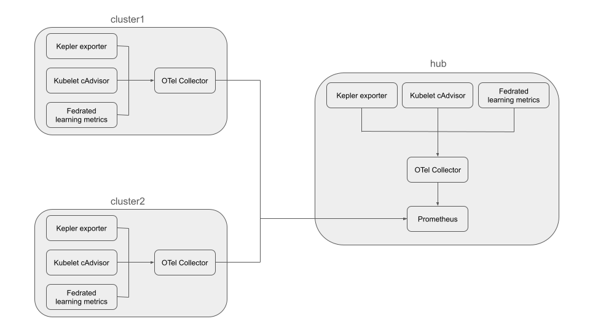

# Multi-Cluster Kubernetes Sustainability Monitoring with OpenTelemetry

This project provides a comprehensive solution for monitoring sustainability and performance metrics across a multi-cluster Kubernetes environment managed by [Open Cluster Management (OCM)](https://open-cluster-management.io/).

It leverages [Kepler](https://github.com/sustainable-computing-io/kepler) to export energy consumption metrics, an [OpenTelemetry (OTel) Collector](https://opentelemetry.io/docs/collector/) to aggregate and forward these metrics, and [Prometheus](https://prometheus.io/) for centralized storage and querying.

## Architecture

The monitoring system is designed with a hub-and-spoke architecture:

*   **Hub Cluster**: A central OCM management cluster that runs Prometheus to aggregate and store metrics from all managed clusters.
*   **Spoke Clusters (cluster1, cluster2)**: Managed clusters that run Kepler and the OpenTelemetry agent to collect local sustainability metrics and forward them to the Hub Cluster.



## Prerequisites

Before you begin, ensure you have the following tools installed:

*   [Kind (Kubernetes in Docker)](https://kind.sigs.k8s.io/)
*   `kubectl`
*   `git`
*   `helm`

## Test Environment Setup

A setup script is provided to create a complete three-cluster OCM test environment (1 hub, 2 spokes).

```bash
bash ./local-up.sh
```

After the script completes, you can verify that the clusters are registered with the hub:

```bash
kubectl --context kind-hub get managedclusters
```

You should see an output similar to this:
```text
NAME            HUB ACCEPTED   MANAGED CLUSTER URLS                  JOINED   AVAILABLE   AGE
cluster1        true           https://cluster1-control-plane:6443   True     True        3h36m
cluster2        true           https://cluster2-control-plane:6443   True     True        3h36m
local-cluster   true           https://hub-control-plane:6443        True     True        3h35m
```

---

## Deployment Guide

Follow these steps to deploy the monitoring stack and the OpenTelemetry add-on.

### 1. Generate TLS Certificates

First, create a `monitoring` namespace on the hub cluster for Prometheus.

```bash
kubectl --context kind-hub create namespace monitoring
```

Next, run the certificate generation script. This script automates the creation of the necessary Certificate Authorities (CAs) and TLS certificates for securing communication (mTLS) between Prometheus and the OTel collectors. It will also create the required Kubernetes secrets.

```bash
cd hack/certs
bash ./generate-certs.sh
cd ../..
```

### 2. Install Prometheus

This step installs the `kube-prometheus-stack`, which includes Prometheus, on the hub cluster. The configuration enables the remote write receiver, allowing it to ingest metrics from the OTel collectors.

First, add the Prometheus community Helm repository:

```shell
helm repo add prometheus-community https://prometheus-community.github.io/helm-charts
helm repo update
```

Now, install Prometheus using the provided Helm values file:

```shell
helm --kube-context kind-hub install prometheus prometheus-community/kube-prometheus-stack \
  --namespace monitoring \
  -f ./hack/prom/values.yaml
```

### 3. Install the OTel Add-on

This add-on deploys the necessary components (Kepler exporter and OTel collector) to the managed clusters via OCM's add-on framework.

First, create a namespace for the add-on on all clusters:
```shell
kubectl --context kind-hub create namespace open-cluster-management-addon
```

Then, apply the Kustomization to deploy the add-on resources:

```shell
kubectl --context kind-hub apply -k deploy
```

The OCM add-on manager will now distribute the OTel collector and Kepler to the managed clusters as defined by the `Placement` resource.

---

## Verification

After all components are deployed, you can verify that metrics are being collected from all clusters by querying Prometheus on the hub cluster.

Run a query for a Kepler metric, such as `kepler_container_joules_total`. The results should show time series with distinct `cluster_name` labels (`hub`, `cluster1`, `cluster2`), confirming that metrics are being successfully aggregated from all clusters.

### Example PromQL Queries

*   **Power consumption rate on the hub cluster:**
    ```promql
    rate(kepler_container_joules_total{cluster_name="hub"}[5m])
    ```

*   **CPU usage rate on cluster1:**
    ```promql
    rate(container_cpu_usage_seconds_total{cluster_name="cluster1"}[5m])
    ```

*   **CPU usage from a specific namespace on cluster2:**
    ```promql
    container_cpu_usage_seconds_total{exported_namespace="open-cluster-management", cluster_name="cluster2"}
    ```
