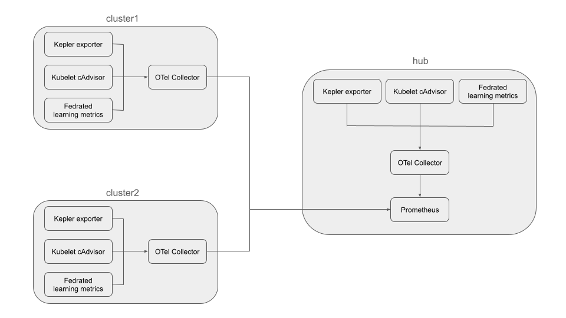

# Configure Environment for Observability

This document provides a solution for monitoring sustainability and performance metrics across a multi-cluster Kubernetes environment managed by [Open Cluster Management (OCM)](https://open-cluster-management.io/).

It leverages [Kepler](https://github.com/sustainable-computing-io/kepler) to export energy consumption metrics, an [OpenTelemetry (OTel) Collector](https://opentelemetry.io/docs/collector/) to aggregate and forward these metrics, and [Prometheus](https://prometheus.io/) for centralized storage and querying.

## Architecture

The monitoring system is designed with the architecture:



*   **Prometheus**: A time-series database for storing and querying metrics, which will be installed on the hub cluster.
*   **OpenTelemetry Collector (otel-collector)**: A component that collects metrics from the managed clusters and forwards them to the Prometheus instance on the hub cluster. It will be installed on all managed clusters.
*   **Kepler**: A tool for measuring energy consumption of Kubernetes pods. It will be installed on all managed clusters.

## Prerequisites

Before you begin, ensure you have the following tools installed:

*   [Kind (Kubernetes in Docker)](https://kind.sigs.k8s.io/)
*   `kubectl`
*   `git`
*   `helm`

### Enable local-cluster

To collect metrics from the hub cluster itself, we first need to register it as a managed cluster, a common practice known as `local-cluster`.

We assume that you have already installed the environment with 2 managed clusters according to the [Set Up the Environment](../README.md#set-up-the-environment) guide.

```bash
# join command
joincmd=$(clusteradm get token --context kind-hub | grep clusteradm)

# join hub cluster as local-cluster
$(echo ${joincmd} --force-internal-endpoint-lookup --wait --context kind-hub | sed "s/<cluster_name>/local-cluster/g")

# accept local-cluster
clusteradm accept --context kind-hub --clusters local-cluster --wait
```

### Verify the environment

Now you can verify that the clusters are registered with the hub:

```bash
$ kubectl --context kind-hub get managedclusters
NAME            HUB ACCEPTED   MANAGED CLUSTER URLS                  JOINED   AVAILABLE   AGE
cluster1        true           https://cluster1-control-plane:6443   True     True        3h36m
cluster2        true           https://cluster2-control-plane:6443   True     True        3h36m
local-cluster   true           https://hub-control-plane:6443        True     True        3h35m
```

---

## Deployment Guide

Follow these steps to deploy the monitoring stack and the OpenTelemetry add-on.

### 1. Generate TLS Certificates

First, create a `monitoring` namespace on the hub cluster for Prometheus.

```bash
kubectl --context kind-hub create namespace monitoring
```

Next, run the certificate generation script. This script automates the creation of the necessary Certificate Authorities (CAs) and TLS certificates for securing communication (mTLS) between Prometheus and the OTel collectors. It will also create the required Kubernetes secrets.

```bash
cd federated-learning-controller/deploy/obs/hack/certs
./generate-certs.sh
cd ../..
```

### 2. Install Prometheus

This step installs the `kube-prometheus-stack`, which includes Prometheus, on the hub cluster. The configuration enables the remote write receiver, allowing it to ingest metrics from the OTel collectors.

First, add the Prometheus community Helm repository:

```bash
helm repo add prometheus-community https://prometheus-community.github.io/helm-charts
helm repo update
```

Now, install Prometheus using the provided Helm values file:

```bash
helm --kube-context kind-hub install prometheus prometheus-community/kube-prometheus-stack \
  --namespace monitoring \
  -f ./hack/prom/values.yaml
```

### 3. Install the OpenTelemetry Add-on

This add-on deploys the necessary components (Kepler exporter and OTel collector) to the managed clusters via OCM's add-on framework.

First, create a namespace for the add-on on hub cluster:
```bash
kubectl --context kind-hub create namespace open-cluster-management-addon
```

Then, apply the Kustomization to deploy the add-on resources:

```bash
kubectl --context kind-hub apply -k otel-addon
```

The OCM add-on manager will now distribute the OTel collector and Kepler to the managed clusters as defined by the `Placement` resource.

---

## Verification

After all components are deployed, you can verify that metrics are being collected from all clusters by querying Prometheus on the hub cluster.

Run a query for a Kepler metric, such as `kepler_container_joules_total`. The results should show time series with distinct `cluster_name` labels (`hub`, `cluster1`, `cluster2`), confirming that metrics are being successfully aggregated from all clusters.

**NOTE**: Please replace `hub-control-plane` with the actual address of the hub cluster. If you are using Kind in macOS or Windows, you can configure port mapping according to [extra port mapping](https://kind.sigs.k8s.io/docs/user/configuration/#extra-port-mappings).

```bash
$ curl -ksS https://hub-control-plane:30090/api/v1/query?query=kepler_container_joules_total | jq         
{
  "status": "success",
  "data": {
    "resultType": "vector",
    "result": [
      {
        "metric": {
          "__name__": "kepler_container_joules_total",
          "cluster_name": "local-cluster",
          "container_id": "037ac5839960d853b607d77a8501c6ddc244cbe22f3e6994508662b5ea1376eb",
          "container_name": "klusterlet",
          "container_namespace": "open-cluster-management",
          "instance": "10.244.0.42:9102",
          "job": "kepler",
          "k8s_container_name": "kepler-exporter",
          "k8s_daemonset_name": "kepler-exporter",
          "k8s_namespace_name": "open-cluster-management-agent-addon",
          "k8s_node_name": "hub-control-plane",
          "k8s_pod_name": "kepler-exporter-sdljk",
          "k8s_pod_uid": "9c846e33-5e18-4150-9b9e-1517104b6972",
          "mode": "dynamic",
          "pod_name": "klusterlet-7d8bd449cc-zftcw",
          "server_address": "10.244.0.42",
          "server_port": "9102",
          "service_instance_id": "10.244.0.42:9102",
          "service_name": "kepler",
          "url_scheme": "http"
        },
        "value": [
          1753535725.037,
          "5.778"
        ]
      },
      {
        "metric": {
          "__name__": "kepler_container_joules_total",
          "cluster_name": "local-cluster",
          "container_id": "8abc271d1180f59ee706546513f07e34f2dac64f3c9d91d3641007e90c5fefc3",
          "container_name": "klusterlet",
          "container_namespace": "open-cluster-management",
          "instance": "10.244.0.42:9102",
          "job": "kepler",
          "k8s_container_name": "kepler-exporter",
          "k8s_daemonset_name": "kepler-exporter",
          "k8s_namespace_name": "open-cluster-management-agent-addon",
          "k8s_node_name": "hub-control-plane",
          "k8s_pod_name": "kepler-exporter-sdljk",
          "k8s_pod_uid": "9c846e33-5e18-4150-9b9e-1517104b6972",
          "mode": "idle",
          "pod_name": "klusterlet-7d8bd449cc-cj52x",
          "server_address": "10.244.0.42",
          "server_port": "9102",
          "service_instance_id": "10.244.0.42:9102",
          "service_name": "kepler",
          "url_scheme": "http"
        },
        "value": [
          1753535725.037,
          "0"
        ]
      },
      ...
    ]
  }
}
```

## Application Level Observability

In the federated learning process, it is crucial to monitor application-level metrics to gain insights into the model's training performance.

### Background

The sidecar is designed to export application-level metrics, such as the accuracy and loss value during the training process. This allows for real-time monitoring and analysis of the federated learning tasks.

### Architecture

A sidecar container runs alongside the federated learning application. The application writes its metrics to a JSON file at `/metrics/metric.json`. The sidecar watches this file, parses the metrics, and exposes them to an OpenTelemetry (OTel) exporter, which then sends them to an observability backend.

### How to Export Metrics

To export metrics, the training application needs to write a JSON file with a specific schema to the path `/metrics/metric.json`.

**NOTE:** 

- When updating the metrics each time, it will automatically add the `timestamp` field to the metrics. But if the `metric.json` file already contains a `timestamp` field, it will overwrite the value with the current timestamp.

- If the JSON file has a `round` field, the sidecar will use it as a label for the other metrics instead of using the `round` field as a metric value. But if the `round` field is not present, the sidecar will use the label `round="nil"`.

To enable the sidecar, specify the obs-sidecar-image annotation in the FederatedLearning resource with a valid image reference; if the annotation is omitted or set to an empty string, the sidecar will not be injected. For example enabling the sidecar for a FederatedLearning resource:

```yaml
apiVersion: federation-ai.open-cluster-management.io/v1alpha1
kind: FederatedLearning
metadata:
  name: federated-learning-sample
  annotations:
    obs-sidecar-image: crpi-4znmwrgbdtn86v19.cn-hangzhou.personal.cr.aliyuncs.com/mrrr61/fl_sidecar:0.9.3
spec:
  framework: flower
  server:
    image: quay.io/open-cluster-management/flower-app-torch:latest
    rounds: 3
    minAvailableClients: 2
    listeners:
      - name: server-listener
        port: 8080
        type: LoadBalancer
    storage:
      type: PersistentVolumeClaim
      name: model-pvc
      path: /data/models
      size: 2Gi
  client:
    image: quay.io/open-cluster-management/flower-app-torch:latest
    placement:
      clusterSets:
        - global
      predicates:
        - requiredClusterSelector:
            claimSelector:
              matchExpressions:
                - key: federated-learning-sample.client-data
                  operator: Exists
```

#### JSON Sample

Here is an example of the `metric.json` file format:

```json
{
  "epoch": 1,
  "loss": 0.543,
  "accuracy": 0.87
}
```

#### Python Helper Function

For applications written in Python, you can leverage the following helper function to write metrics in the correct format.

```python
import json
import os

def write_metrics(metrics: dict, filepath: str = "/metrics/metric.json"):
    """Write metrics dictionary to the JSON file"""
    try:
        os.makedirs("/metrics", exist_ok=True)
        with open(filepath, "w", encoding="utf-8") as f:
            json.dump(metrics, f, ensure_ascii=False)
        print(f"Metrics written to {filepath}")
    except Exception as e:
        print("write json file error: ", e)

```
This function takes the `metrics` and `filepath` as input parameters, which can write the metrics to the specified(default: `/metrics/metric.json`) file.

#### Metrics Result Sample

Here is an example of the metrics result:

```json
$ curl -ksS 'https://172.18.0.2:30090/api/v1/query?query=loss' | jq
{
  "status": "success",
  "data": {
    "resultType": "vector",
    "result": [
      {
        "metric": {
          "__name__": "loss",
          "cluster_name": "local-cluster",
          "job": "federated-learning-obs-sidecar",
          "namespace": "default",
          "pod_name": "federated-learning-sample-server-cvcrj",
          "round": "1",
          "service_name": "federated-learning-obs-sidecar",
          "telemetry_sdk_language": "go",
          "telemetry_sdk_name": "opentelemetry",
          "telemetry_sdk_version": "1.37.0"
        },
        "value": [
          1755661045.113,
          "0.4178483188152313"
        ]
      },
      {
        "metric": {
          "__name__": "loss",
          "cluster_name": "local-cluster",
          "job": "federated-learning-obs-sidecar",
          "namespace": "default",
          "pod_name": "federated-learning-sample-server-cvcrj",
          "round": "2",
          "service_name": "federated-learning-obs-sidecar",
          "telemetry_sdk_language": "go",
          "telemetry_sdk_name": "opentelemetry",
          "telemetry_sdk_version": "1.37.0"
        },
        "value": [
          1755661045.113,
          "0.17652101069688797"
        ]
      },
      {
        "metric": {
          "__name__": "loss",
          "cluster_name": "local-cluster",
          "job": "federated-learning-obs-sidecar",
          "namespace": "default",
          "pod_name": "federated-learning-sample-server-cvcrj",
          "round": "3",
          "service_name": "federated-learning-obs-sidecar",
          "telemetry_sdk_language": "go",
          "telemetry_sdk_name": "opentelemetry",
          "telemetry_sdk_version": "1.37.0"
        },
        "value": [
          1755661045.113,
          "0.10298225283622742"
        ]
      }
    ]
  }
}
```

### Building and Running a Custom Sidecar

If you need to customize the sidecar or build your own image, follow these steps.

#### Build the Image

Run the following command to build the Docker image. Before building and pushing, make sure to update the `REGISTRY` variable in the `internal/sidecar/Makefile` to your own container registry (e.g., `docker.io/username`).

```bash
cd federated-learning-controller
make docker-sidecar-build
```

#### Push the Image

```bash
make docker-sidecar-push
```

#### Run the Container

Use the `docker run` command to start the sidecar. You must mount the metric file's directory into the container and provide the necessary arguments.

```bash
docker run --rm \
  -v /path/on/host/to/metrics:/app/metrics \
  your-registry/fl-sidecar:latest \
  -metricfile /app/metrics/fl_metrics.txt \
  -endpoint host.docker.internal:4317
```
