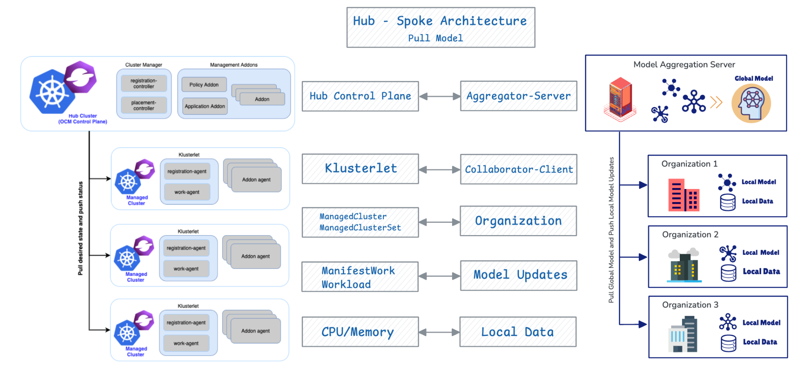

# Why Open Cluster Management for Federated Learning

## Summary

Both Open Cluster Management (OCM) and Federated Learning (FL) use a hub-spoke architecture with a pull-based model. In OCM, managed clusters pull desired state and push status to the hub; in FL, collaborators pull the global model and push updates to the aggregator. The OCM Hub functions like the FL server, while managed clusters act as collaborators.

## Architectures

- **In Open Cluster Management (OCM)**, each managed cluster (spoke) runs an agent (called the *klusterlet*) that **pulls declared “prescriptions”** — such as policies, workloads, and configurations — from the central hub cluster, rather than the hub pushing them out. After applying or reconciling those prescriptions locally, the agent **reports back status, health, and results** to the hub, allowing the hub to maintain an up-to-date view and enabling eventual consistency across a large number of clusters.

- **In Federated Learning (FL)**, each collaborator (or client) periodically **pulls the latest global model** from a central aggregator. Using its own local dataset, the collaborator then **trains the model independently**, without sharing any raw data, preserving privacy and data sovereignty. Once local training is complete, the collaborator **pushes model updates** back to the aggregator. The aggregator then **aggregates these updates** from all collaborators to produce an improved global model, which is redistributed for the next training round. This iterative pull-and-push loop enables collaborative model improvement while keeping data decentralized.

- In this analogy, the **OCM Hub** acts like the **aggregator** in Federated Learning, defining the global state that clusters pull and report back on. Each **Managed Cluster** works like a **collaborator**, applying the desired state locally and pushing results to the hub—similar to how FL clients train locally and send updates to the server.

Using **OCM** brings extra value to the FL setting: client selection and coordination can leverage OCM’s built-in mechanisms such as **Placement** and **ManifestWork**. This allows the hub to efficiently choose which clusters participate and to distribute workloads or configurations automatically, making federated deployment and management more **scalable and consistent**.