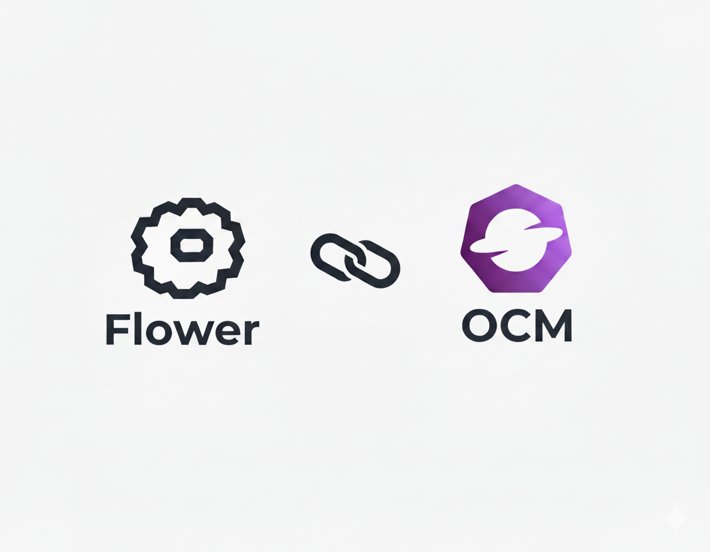

# Flower Addon for Federated AI

[](LICENSE)
[](https://goreportcard.com/report/github.com/open-cluster-management-io/ocm)

<p align="center">
  
</p>

Integrate [Flower Federated Learning](https://flower.ai) with [Open Cluster Management (OCM)](https://open-cluster-management.io) to enable automated distribution and orchestration of federated learning workloads across multi-cloud environments.

## Challenges

Deploying federated learning at scale across multiple clusters and edge devices presents significant operational challenges:

- **Complex Deployment**: SuperNodes must be deployed and configured on each participating cluster
- **Manual Registration**: SuperNodes need to be manually registered with the central SuperLink
- **Collaborator Scheduling**: SuperNodes cannot automatically discover suitable clusters, requiring manual selection and deployment
- **Dynamic Scaling**: No horizontal scaling for SuperNodes based on cluster status or workload demands
- **Application Distribution**: ClientApp containers must be manually pinned to SuperNodes in process isolation mode (recommended for production)

Flower Addon leverages OCM's multi-cluster management to address these challenges:

## Features

| Capability | Description |
|------------|-------------|
| **Deployment** | Declarative SuperNode deployment across clusters via [OCM Addon](https://open-cluster-management.io/concepts/addon/) |
| **Registration** | Automatic SuperNode registration with [SuperLink](https://flower.ai/docs/framework/ref-api/flwr.superlink.html) via secure connections |
| **Scheduling** | Select clusters/devices to launch SuperNode using [Placement](https://open-cluster-management.io/concepts/placement/) based on resources (GPU, Datacenter, etc.), labels, or custom strategies |
| **Scaling** | Horizontal scaling of SuperNodes based on cluster/device status via Placement |
| **Application Distribution** | Distribute [ClientApp](https://flower.ai/docs/framework/docker/tutorial-quickstart-docker.html) containers via [ManifestWorkReplicaSet](https://open-cluster-management.io/docs/concepts/work-distribution/manifestworkreplicaset/) for process isolation mode |

## Architecture

```
┌─────────────────────────────────────────────────────────────┐
│                        Hub Cluster                          │
│  ┌────────────────────────────────────────────────────────┐ │
│  │  SuperLink + ServerApp                                 │ │
│  └────────────────────────────────────────────────────────┘ │
│  ┌────────────────────────────────────────────────────────┐ │
│  │  OCM Addon Manager                                     │ │
│  └────────────────────────────────────────────────────────┘ │
└─────────────────────────────────────────────────────────────┘
                              │
              ┌───────────────┴───────────────┐
              ▼                               ▼
┌─────────────────────────────┐ ┌─────────────────────────────┐
│      Managed Cluster 1      │ │      Managed Cluster 2      │
│   SuperNode + ClientApp     │ │   SuperNode + ClientApp     │
└─────────────────────────────┘ └─────────────────────────────┘
```

## Roadmap

- [x] [Install Flower Addon](docs/install-flower-addon.md) - Deploy SuperLink and SuperNodes via OCM Addon ([demo](https://asciinema.org/a/776744))
- [x] [Auto-Install with Placement](docs/auto-install-by-placement.md) - Schedule SuperNodes across clusters via OCM Placement ([demo](https://asciinema.org/a/776746))
- [x] [Run Federated Learning Applications](docs/run-federated-app.md) - Run federated learning applications on the Flower Addon environment ([demo](https://asciinema.org/a/776749))
- [x] Automatic ClientApp distribution via ManifestWorkReplicaSet
- [ ] TLS-secured SuperNode-SuperLink connections via Addon auto-registration

## Related Projects

- [Flower](https://flower.ai) - A friendly federated learning framework
- [Open Cluster Management](https://open-cluster-management.io) - Multi-cluster management for Kubernetes
