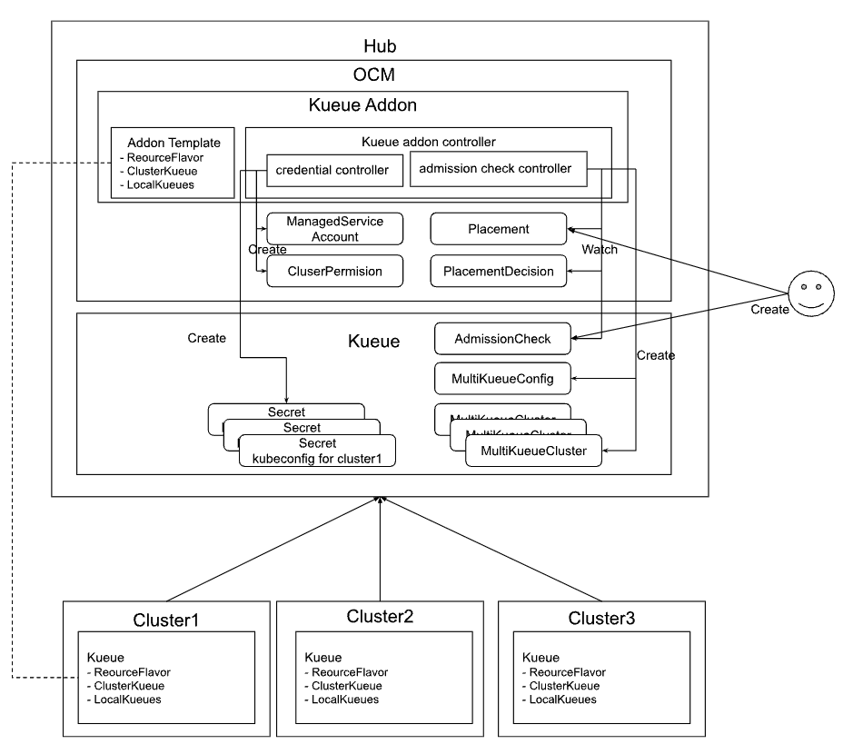

# Kueue Addon for Open Cluster Management

This addon provides an integration between Kueue and Open Cluster Management (OCM) to simplify MultiKueue setup and enhance multicluster scheduling capabilities.

This integration is designed for Kueue users who want to leverage OCM's capabilities to improve their multicluster workload scheduling experience. 

The Kueue addon offers two primary benefits:

- **Simplified MultiKueue Setup**
   - Automates the generation of MultiKueue specific Kubeconfig.
   - Streamlines the configuration of MultiKueue resources.

- **Enhanced Multicluster Scheduling**
   - Integrates with OCM's placement with MultiKueue by implementing an admission check controller.
   - Generate MultiKueueConfig & MultiKueueCluster dynamically based on OCM placement decision.


## Description

This repository contains the kueue addon controller and addon chart to deploy resources to hub and spoke clusters.

### Architecture Overview



### Kueue addon controller
This controller is running on the hub, contains a credential controller and an admission check controller.
- **Credential Controller**
    - Create `ClusterPermission` and `ManagedServiceAccount` for each spoke to get credential.
    - Generates kubeconfig secrets for MultiKueue under `kueue-system` namespace.
- **Admission Check Controller**
    - Watches the `Placement` and `PlacementDecision` to generates `MultiKueueConfig` and `MultiKueueCluster` resources dynamically.
    - Set the `AdmissionCheck` condition `Active` to true when success.

### Addon chart
- **Addon deployment:** Deploy [Kueue addon controllers](#kueue-addon-controller) on the hub.
- **Addon Template:** To deploy `ResourceFlavor`, `ClusterQueue` and `LocalQueue` resources need by MultiKueue to spoke clusters.
- **Other addon files:**  `ClusterManagementAddOn`, `ClusterRole`, `ClusterRoleBinding`, `ManagedClusterSetBinding`, `Placement` etc. 

## Prerequisites

- Open Cluster Management (OCM) installed with the following addons:
  - [Cluster Permission Addon](https://github.com/open-cluster-management-io/cluster-permission)
  - [Managed Service Account Addon](https://github.com/open-cluster-management-io/managed-serviceaccount)
- Kueue already installed on the hub and spoke cluster
- MultiKueue enabled on the hub

## Quick Start

**_Important_**: The addon requires you already installed OCM, Cluster Permission Addon, Managed Service Account Addon and Kueue. 
The whole setup steps about this solution, please refer to this [Kueue Integration Solution](https://github.com/open-cluster-management-io/ocm/blob/main/solutions/kueue-admission-check).

## Installation

On the hub cluster, deploy the addon.

```bash
make deploy
```

You can install the addons via the helm charts.

```bash
$ helm repo add ocm https://open-cluster-management.io/helm-charts/
$ helm repo update
$ helm search repo ocm/kueue-addon
NAME            CHART VERSION   APP VERSION     DESCRIPTION
ocm/kueue-addon <chart-version> <app-version>           A Helm chart for Open Cluster Management Kueue ...
$ helm install \
    -n open-cluster-management-addon --create-namespace \
    kueue-addon ocm/kueue-addon
    # Uncomment the following lines to customize your installation:
    # --set skipClusterSetBinding=true \
    # --set image.tag=<chart-version> \
```

To confirm the installation from hub:

```bash
$ kubectl get cma kueue-addon
NAME          DISPLAY NAME   CRD NAME
kueue-addon   kueue-addon    

$ kubectl get mca -A | grep kueue-addon
NAMESPACE          NAME                     AVAILABLE   DEGRADED   PROGRESSING
<your cluster>     kueue-addon              True                   False

$ kubectl get deploy -n open-cluster-management  kueue-addon-controller
NAME                     READY   UP-TO-DATE   AVAILABLE   AGE
kueue-addon-controller   1/1     1            1           4h27m
```

To confirm the installation from spoke:

```bash
$ kubectl get clusterqueue
NAME            COHORT   PENDING WORKLOADS
cluster-queue            0

$ kubectl get localqueue
NAME         CLUSTERQUEUE    PENDING WORKLOADS   ADMITTED WORKLOADS
user-queue   cluster-queue   0                   0

$ kubectl get resourceflavor
NAME             AGE
default-flavor   4h28m
```

## Usage

The usage please refer to this [Kueue Integration Solution](https://github.com/open-cluster-management-io/ocm/blob/main/solutions/kueue-admission-check).

## Design Details and Workflow

### OCM Admission Check Controller

The OCM Admission Check Controller will integrate OCM `Placement` results into MultiKueue by reading `PlacementDecisions` and generating the necessary `MultiKueueConfig` and `MultiKueueCluster` resources.

- `controllerName`: Identifies the controller that processes the Admission Check, currently set to `open-cluster-management.io/placement`
- `parameters`: Identifies a configuration with additional parameters for the check, here we add the existing OCM resource `Placement`. Clusters specified in the `Placement` will be bound to the `kueue-system` namespace.

Example OCM AdmissionCheck CR:

```yaml
# OCM implements an admissioncheck controller to automate the MultiKueue setup process.
# Leverages OCM's placement mechanism to select clusters based on specific criteria. 
# MultiKueueConfigs and MultiKueueClusters are generated dynamically based on OCM placement decisions.
apiVersion: kueue.x-k8s.io/v1beta1
kind: AdmissionCheck
metadata:
  name: multikueue-config-demo2
spec:
  controllerName: open-cluster-management.io/placement
  parameters:
    apiGroup: cluster.open-cluster-management.io
    kind: Placement
    name: multikueue-config-demo2
```
### Configuration Process: Before and After OCM Admission Check Controller

**Before:**

Admins manually create both `MultiKueueConfig` (listing clusters) and a `MultiKueueCluster` (with kubeconfig secret) for each cluster.

```yaml
apiVersion: kueue.x-k8s.io/v1beta1
kind: MultiKueueConfig
metadata:
  name: multikueue-config-demo1
spec:
  clusters:
  - multikueue-config-demo1-cluster1
  - multikueue-config-demo1-cluster2
---
apiVersion: kueue.x-k8s.io/v1beta1
kind: MultiKueueCluster
metadata:
  name: multikueue-config-demo1-cluster1
spec:
  kubeConfig:
    locationType: Secret
    location: multikueue-cluster1
---
apiVersion: kueue.x-k8s.io/v1beta1
kind: MultiKueueCluster
metadata:
  name: multikueue-config-demo1-cluster2
spec:
  kubeConfig:
    locationType: Secret
    location: multikueue-cluster2
```

**After:**

Admins only need to add `AdmissionChecks` to the `ClusterQueue`. The controller automates `MultiKueueConfig` and `MultiKueueCluster` creation based on `Placement` decisions.

```yaml
apiVersion: kueue.x-k8s.io/v1beta1
kind: ClusterQueue
metadata:
  name: "cluster-queue"
spec:
...
  admissionChecks:
  - multikueue-demo2
  - multikueue-config-demo2
---
apiVersion: kueue.x-k8s.io/v1beta1
kind: AdmissionCheck
metadata:
  name: multikueue-demo2
spec:
  controllerName: kueue.x-k8s.io/multikueue
  parameters:
    apiGroup: kueue.x-k8s.io
    kind: MultiKueueConfig
    name: multikueue-config-demo2
---
apiVersion: kueue.x-k8s.io/v1beta1
kind: AdmissionCheck
metadata:
  name: multikueue-config-demo2
spec:
  controllerName: open-cluster-management.io/placement
  parameters:
    apiGroup: cluster.open-cluster-management.io
    kind: Placement
    name: multikueue-config-demo2
```

This automation greatly reduces manual effort and ensures that MultiKueue environments always reflect the latest OCM Placement decisions, supporting advanced scheduling scenarios such as label-based selection and dynamic scoring with `AddonPlacementScore`.

### Workflow

- When kueue-addon is intalled, the credential controller generates kubeconfig secrets of each cluster for MultiKueue under `kueue-system` namespace.
- User configure the `ClusterQueue` with `AdmissionCheck` and creates the `AdmissionCheck` and `Placement` resources.
- OCM generates `PlacementDecision` when `Placement` created.
- The admission check controller watches for `AdmissionCheck` resources referencing OCM `Placement`.
- The admission check controller watches the `PlacementDecision`, creates or updates `MultiKueueCluster` resources with the kubeconfig details for each cluster, and also update these clusters in the `MultiKueueConfig` resource.
- Finally, admission check controller updates the `AdmissionCheck` condition to true, indicating successful generation of the `MultiKueueConfig` and `MultiKueueCluster`, readying the [MultiKueue](https://kueue.sigs.k8s.io/docs/concepts/multikueue/) environment for job scheduling.

