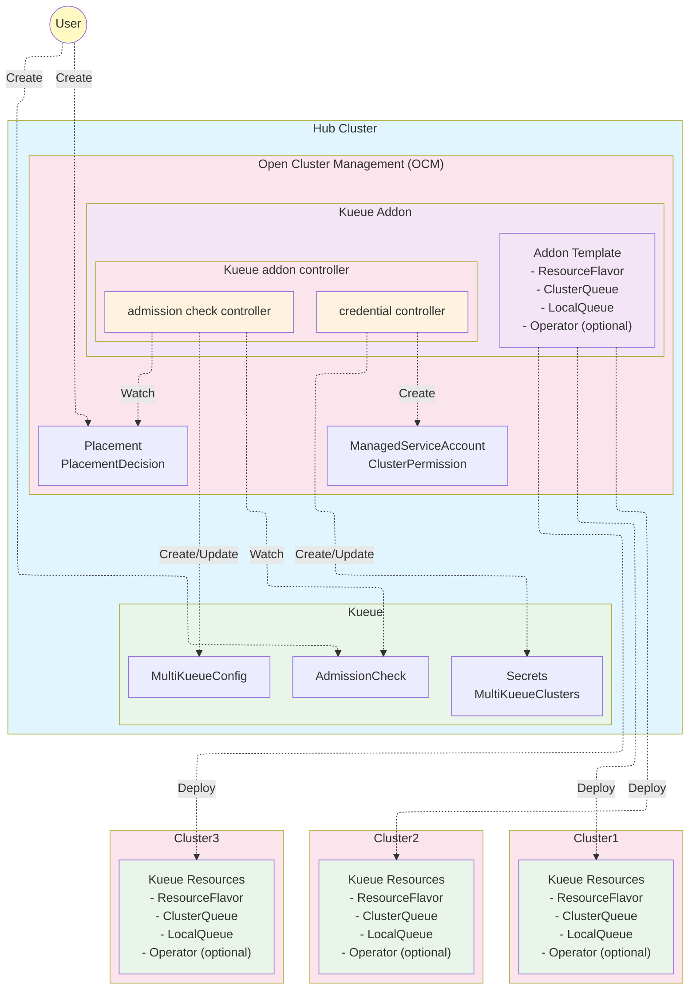

# Kueue Addon for Open Cluster Management

This addon provides an integration between [Kueue](https://kueue.sigs.k8s.io/) and Open Cluster Management (OCM) to simplify MultiKueue setup and enhance multicluster scheduling capabilities.

This integration is designed for Kueue users who want to leverage OCM's capabilities to improve their multicluster workload scheduling experience. 

The Kueue addon offers below benefits:

- **Simplified MultiKueue Setup**
   - Automates the generation of MultiKueue specific Kubeconfig.
   - Streamlines the configuration of MultiKueue resources.
   - Eliminates manual secret management.

- **Centralizing Resource management**
   - Manage spoke resources (ResourceFlavor, ClusterQueue, LocalQueue) from a single hub.
   - Template-based deployment.

- **Enhanced Multicluster Scheduling**
   - Integrates with OCM's placement with MultiKueue by implementing an admission check controller.
   - Generate MultiKueueConfig & MultiKueueCluster dynamically based on OCM placement decision.
   - Supports advanced placement strategies.

- **Flexible Installation Options**
   - Standard installation for existing Kueue setups.
   - Operator-based installation for OpenShift/OLM environments.
   - Cluster proxy support for enhanced connectivity.

## Description

This repository contains the kueue addon controller and addon chart to deploy resources to hub and spoke clusters.

### Architecture Overview



### Kueue addon controller
This controller is running on the hub, contains a credential controller and an admission check controller.
- **Credential Controller**
    - Create `ClusterPermission` and `ManagedServiceAccount` for each spoke to get credential.
    - Generates kubeconfig secrets for MultiKueue under `kueue-system` namespace.
- **Admission Check Controller**
    - Watches the `Placement` and `PlacementDecision` to generates `MultiKueueConfig` and `MultiKueueCluster` resources dynamically.
    - Set the `AdmissionCheck` condition `Active` to true when success.

### Addon chart
- **Addon deployment:** Deploy [Kueue addon controllers](#kueue-addon-controller) on the hub.
- **Addon Template:** To deploy `ResourceFlavor`, `ClusterQueue` and `LocalQueue` resources need by MultiKueue to spoke clusters.
- **Kueue Operator Template:** Optional operator-based Kueue installation on spoke clusters.
- **Other addon files:**  `ClusterManagementAddOn`, `ClusterRole`, `ClusterRoleBinding`, `ManagedClusterSetBinding`, `Placement` etc.

## Prerequisites

- Open Cluster Management (OCM) installed with the following addons:
  - [Cluster Permission Addon](https://github.com/open-cluster-management-io/cluster-permission)
  - [Managed Service Account Addon](https://github.com/open-cluster-management-io/managed-serviceaccount)
  - [Cluster Proxy Addon](https://github.com/open-cluster-management-io/cluster-proxy) (Optional) Enables hub-to-spoke connectivity for enhanced networking.
- Kueue installed:
  - Hub Cluster with [Kueue](https://kueue.sigs.k8s.io/docs/installation/) installed and MultiKueue enabled.
  - Spoke Clusters with [Kueue](https://kueue.sigs.k8s.io/docs/installation/) pre-installed, or let this addon install Kueue via [operator](https://github.com/openshift/kueue-operator) (recommended for OpenShift/OLM environments).

## Quick Start

For a complete setup including all prerequisites on Kind:

```bash
./build/setup-env.sh
```

## Installation

### Step 1: Add Helm Repository

```bash
$ helm repo add ocm https://open-cluster-management.io/helm-charts/
$ helm repo update
$ helm search repo ocm/kueue-addon
NAME            CHART VERSION   APP VERSION     DESCRIPTION
ocm/kueue-addon <chart-version> <app-version>           A Helm chart for Open Cluster Management Kueue ...
```

### Step 2: Choose Your Installation Method

#### Option A: Standard Installation (Kueue Pre-installed)

For environments where Kueue is already installed:

```bash
$ helm install \
    -n open-cluster-management-addon --create-namespace \
    kueue-addon ocm/kueue-addon
    # Uncomment the following lines to customize your installation:
    # --set skipClusterSetBinding=true
```

#### Option B: Operator-based Installation (OpenShift/OLM)

In operator-based environments (for example, OpenShift with OLM), the addon can install the [Kueue operator](https://github.com/openshift/kueue-operator) for you.

Prepare a values.operator.yaml with below content:

```yaml
# This is the namespace where the Kueue controller is installed; the MultiKueue secret will be copied to this namespace
kueue:
  namespace: "openshift-kueue-operator"

# Install Kueue via Operator
installKueueViaOperator: true

# Operator Lifecycle Manager RBAC configuration
operatorLifecycleManager:
  clusterRoleBindingName: kueue-operator-lifecycle-manager-rolebinding
  clusterRoleName: system:controller:operator-lifecycle-manager

# Kueue Operator configuration
kueueOperator:
  name: kueue-operator
  namespace: openshift-kueue-operator
  operatorGroupName: openshift-kueue-operator
  channel: stable-v1.0
  source: redhat-operators
  sourceNamespace: openshift-marketplace
  startingCSV: kueue-operator.v1.0.1

# Cert Manager Operator configuration
certManagerOperator:
  name: openshift-cert-manager-operator
  namespace: cert-manager-operator
  operatorGroupName: cert-manager-operator
  channel: stable-v1
  source: redhat-operators
  sourceNamespace: openshift-marketplace
  startingCSV: cert-manager-operator.v1.17.0

# Kueue CR customization
kueueCR:
  spec:
    config:
      integrations:
        frameworks:
        - BatchJob
    managementState: Managed

# Cluster proxy configuration
clusterProxy:
  url: "https://<cluster-proxy-url>"
  impersonation:
    enabled: true

networkPolicy:
  name: kueue-allow-egress-cluster-proxy-dns
  namespace: "openshift-kueue-operator"
  spec:
    podSelector:
      matchLabels:
        app.openshift.io/name: kueue
    policyTypes:
    - Egress
    egress:
    - ports:
      - port: 80
        protocol: TCP
    - ports:
      - port: 443
        protocol: TCP
    - to:
      - namespaceSelector:
          matchLabels:
            kubernetes.io/metadata.name: <cluster-proxy-namespace>
```

```bash
$ helm install \
    -n open-cluster-management-addon --create-namespace \
    kueue-addon ocm/kueue-addon \
    -f values.operator.yaml
    # Uncomment the following lines to customize your installation:
    # --set skipClusterSetBinding=true
```

## Verification

To confirm the installation from hub:

```bash
$ kubectl get cma kueue-addon
NAME          DISPLAY NAME                    CRD NAME
kueue-addon   multicluster-kueue-manager

$ kubectl get mca -A | grep kueue
NAMESPACE          NAME                          AVAILABLE   DEGRADED   PROGRESSING
<your cluster>     multicluster-kueue-manager    True                   False

$ kubectl get deploy -n open-cluster-management-addon kueue-addon-controller
NAME                     READY   UP-TO-DATE   AVAILABLE   AGE
kueue-addon-controller   1/1     1            1           4h27m
```

To confirm the installation from spoke:

```bash
$ kubectl get clusterqueue
NAME            COHORT   PENDING WORKLOADS
cluster-queue            0

$ kubectl get localqueue
NAME         CLUSTERQUEUE    PENDING WORKLOADS   ADMITTED WORKLOADS
user-queue   cluster-queue   0                   0

$ kubectl get resourceflavor
NAME             AGE
default-flavor   4h28m
```

## Usage

For detailed usage examples and advanced scenarios, refer to the [Kueue Integration Solution](https://github.com/open-cluster-management-io/ocm/blob/main/solutions/kueue-admission-check).

## Design Details and Workflow

### OCM Admission Check Controller

The OCM Admission Check Controller will integrate OCM `Placement` results into MultiKueue by reading `PlacementDecisions` and generating the necessary `MultiKueueConfig` and `MultiKueueCluster` resources.

- `controllerName`: Identifies the controller that processes the Admission Check, currently set to `open-cluster-management.io/placement`
- `parameters`: Identifies a configuration with additional parameters for the check, here we add the existing OCM resource `Placement`. Clusters specified in the `Placement` will be bound to the `kueue-system` namespace.

Example OCM AdmissionCheck CR:

```yaml
# OCM implements an admissioncheck controller to automate the MultiKueue setup process.
# Leverages OCM's placement mechanism to select clusters based on specific criteria. 
# MultiKueueConfigs and MultiKueueClusters are generated dynamically based on OCM placement decisions.
apiVersion: kueue.x-k8s.io/v1beta1
kind: AdmissionCheck
metadata:
  name: multikueue-config-demo2
spec:
  controllerName: open-cluster-management.io/placement
  parameters:
    apiGroup: cluster.open-cluster-management.io
    kind: Placement
    name: multikueue-config-demo2
```
### Configuration Process: Before and After OCM Admission Check Controller

**Before:**

Admins manually create both `MultiKueueConfig` (listing clusters) and a `MultiKueueCluster` (with kubeconfig secret) for each cluster.

```yaml
apiVersion: kueue.x-k8s.io/v1beta1
kind: MultiKueueConfig
metadata:
  name: multikueue-config-demo1
spec:
  clusters:
  - multikueue-config-demo1-cluster1
  - multikueue-config-demo1-cluster2
---
apiVersion: kueue.x-k8s.io/v1beta1
kind: MultiKueueCluster
metadata:
  name: multikueue-config-demo1-cluster1
spec:
  kubeConfig:
    locationType: Secret
    location: multikueue-cluster1
---
apiVersion: kueue.x-k8s.io/v1beta1
kind: MultiKueueCluster
metadata:
  name: multikueue-config-demo1-cluster2
spec:
  kubeConfig:
    locationType: Secret
    location: multikueue-cluster2
```

**After:**

Admins only need to add `AdmissionChecks` to the `ClusterQueue`. The controller automates `MultiKueueConfig` and `MultiKueueCluster` creation based on `Placement` decisions.

```yaml
apiVersion: kueue.x-k8s.io/v1beta1
kind: ClusterQueue
metadata:
  name: "cluster-queue"
spec:
...
  admissionChecks:
  - multikueue-demo2
  - multikueue-config-demo2
---
apiVersion: kueue.x-k8s.io/v1beta1
kind: AdmissionCheck
metadata:
  name: multikueue-demo2
spec:
  controllerName: kueue.x-k8s.io/multikueue
  parameters:
    apiGroup: kueue.x-k8s.io
    kind: MultiKueueConfig
    name: multikueue-config-demo2
---
apiVersion: kueue.x-k8s.io/v1beta1
kind: AdmissionCheck
metadata:
  name: multikueue-config-demo2
spec:
  controllerName: open-cluster-management.io/placement
  parameters:
    apiGroup: cluster.open-cluster-management.io
    kind: Placement
    name: multikueue-config-demo2
```

This automation greatly reduces manual effort and ensures that MultiKueue environments always reflect the latest OCM Placement decisions, supporting advanced scheduling scenarios such as label-based selection and dynamic scoring with `AddonPlacementScore`.

### Workflow

- When kueue-addon is intalled, the credential controller generates kubeconfig secrets of each cluster for MultiKueue under `kueue-system` namespace.
- User configure the `ClusterQueue` with `AdmissionCheck` and creates the `AdmissionCheck` and `Placement` resources.
- OCM generates `PlacementDecision` when `Placement` created.
- The admission check controller watches for `AdmissionCheck` resources referencing OCM `Placement`.
- The admission check controller watches the `PlacementDecision`, creates or updates `MultiKueueCluster` resources with the kubeconfig details for each cluster, and also update these clusters in the `MultiKueueConfig` resource.
- Finally, admission check controller updates the `AdmissionCheck` condition to true, indicating successful generation of the `MultiKueueConfig` and `MultiKueueCluster`, readying the [MultiKueue](https://kueue.sigs.k8s.io/docs/concepts/multikueue/) environment for job scheduling.
